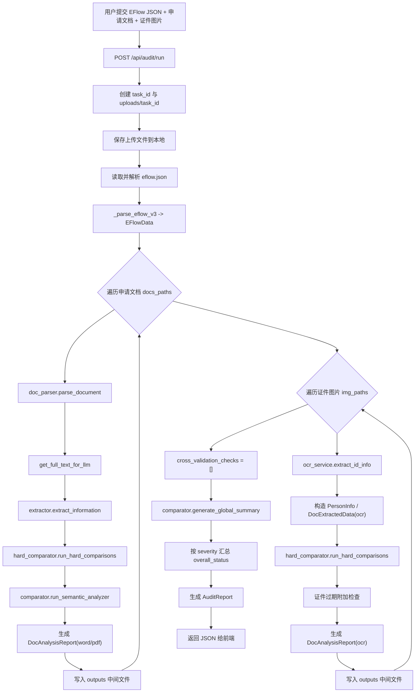

# 银行协议申请预审项目：当前实现事实基线文档

**文档定位**：本文件只描述截至 `2026-04-20` 在当前仓库代码中已经存在、已经接线、能够被验证到的系统事实。  
**文档目标**：为后续的目标架构设计、链路优化、Agentic AI 增强提供统一基线，避免把“历史文档中的设想”误当成“当前真实实现”。  
**事实原则**：
- 以当前仓库代码为准。
- 以主链路实际调用关系为准。
- 明确区分“已实现”“部分实现”“未接入/版本残留”。
- 不在本文件中预设未来方案，不把建议写成事实。

---

## 1. 结论先行

当前项目已经是一个**可运行的、以 FastAPI 为编排中心的多文档银行预审 Demo**。它的主线能力不是早期单文档版本，而是一个偏 V3 的多附件审查流水线：

1. 读取一份 `EFlow JSON` 作为基准事实。
2. 对每一份上传的申请文档执行：
   - 文档解析
   - LLM 结构化抽取
   - 代码级硬比对
   - LLM 语义审查
3. 对每一份证件图片执行：
   - OCR/视觉识别
   - 证件基础核查
4. 汇总全部文档结果，调用大模型生成一份全局综述。
5. 返回统一的审计报告给前端展示。

但从“银行级可审计系统”的标准看，当前实现仍然是**主骨架已成、关键闭环未补齐**的状态。尤其需要注意：

- 已有“多文档逐件审查”，但**跨文档交叉校验层尚未真正实现**。
- 已有“硬比对 + 语义分析”双层判断，但**证据充分性治理不足**。
- 已有“降级可运行”机制，但**降级后的结果仍可能被包装为低风险**。
- 数据模型和主链路已经升级到 V3 风格，但仓库内仍保留若干**旧版接口/旧版模块/旧版文档残留**。

---

## 2. 当前系统的真实目标

从代码与 Prompt 的组合来看，当前系统实际在做的事情是：

- 以 `EFlow` 为“系统基准真相”
- 将 Word / DOC / PDF / 图片证件转成结构化业务事实
- 对比“系统基准”和“客户提交材料”是否一致
- 将不一致项归类为：
  - 基础字段冲突
  - 身份一致性问题
  - 合规完整性问题
  - 业务要素偏差
- 由 LLM 生成汇总式风险综述

换句话说，当前系统本质上是一个**材料一致性与合规风险预审引擎**，而不是一个完整自动审批系统，也不是一个成熟的人机协同工作台。

---

## 3. 当前真实目录与核心模块

### 3.1 后端主模块

- `backend/main.py`
  - FastAPI 入口
  - 注册 `settings` 与 `audit` 路由
  - 提供 `/api/health`
  - 挂载前端静态资源
  - 注册全局异常处理器，并将崩溃栈写入 `outputs/crash_traceback.log`

- `backend/routers/audit.py`
  - 当前系统的**真实主编排器**
  - 负责文件保存、任务目录创建、EFlow 解析、文档与证件逐件处理、全局总结、最终报告封装

- `backend/routers/settings.py`
  - LLM 配置查询、更新、连通性测试

### 3.2 核心服务层

- `backend/services/doc_parser.py`
  - 处理 `.doc` / `.docx` / `.pdf`
  - 负责文本和表格抽取
  - 带有合并单元格去重逻辑 `_dedup_row`

- `backend/services/extractor.py`
  - 对申请文档调用 LLM 做结构化抽取
  - 输出 `DocExtractedData`

- `backend/services/hard_comparator.py`
  - 当前的代码级刚性比对器
  - 负责不可依赖模型主观猜测的字段比对

- `backend/services/comparator.py`
  - 当前的语义分析与全局汇总服务
  - 包含：
    - `run_semantic_analyzer`
    - `generate_global_summary`

- `backend/services/ocr_service.py`
  - 负责证件 OCR / Vision 提取
  - 支持 PaddleOCR 不可用时回退到视觉模型路径
  - 包含身份证与护照/MRZ 的启发式解析逻辑

- `backend/services/llm_client.py`
  - 统一的 OpenAI-compatible 调用层
  - 支持 `openai` 与 `requests` 两种调用模式
  - 提供文本、JSON、Vision JSON 调用

### 3.3 数据模型层

- `backend/models/schemas.py`
  - 当前 V3 风格数据结构的真实中心
  - 定义了：
    - `EFlowData`
    - `DocExtractedData`
    - `UserPermission`
    - `CheckResult`
    - `DocAnalysisReport`
    - `AuditReport`

### 3.4 前端层

- `frontend/index.html`
  - 上传页与结果展示页容器

- `frontend/app.js`
  - 前端的实际交互与渲染逻辑
  - 负责上传、调用接口、渲染 EFlow、文档解析结果、审计明细、LLM 风险洞察

- `frontend/style.css`
  - 样式定义

---

## 4. 当前主链路的真实执行流程

以下流程对应当前代码中的实际调用关系，而非历史设计稿。



---

## 5. 当前数据流与事实锚点

### 5.1 基准事实源

当前系统默认把 `EFlow JSON` 视为最高优先级基准。  
在 `audit.py` 中，所有后续审计动作都围绕 `EFlowData` 展开。

这意味着当前系统的判断哲学是：

- 系统电子流代表“目标申请真相”
- 客户提交的材料必须向它对齐
- 材料之间暂未构成独立于 EFlow 的事实裁决机制

### 5.2 单文档事实抽取

对每份文档，系统并不做模板匹配，而是：

1. 抽取原始文本和表格
2. 拼接成完整上下文
3. 用 `global_document_extraction` prompt 让 LLM 提取统一结构

这说明当前项目已经放弃了传统的“按银行模板写坐标规则”的路线，实际走的是**统一语义抽取路线**。

### 5.3 单证件事实抽取

对证件图片，系统优先尝试：

1. PaddleOCR
2. 规则/MRZ 解析
3. LLM fallback
4. Vision OCR fallback

因此证件链路的事实来源是一个混合漏斗，而不是单一 OCR 引擎。

---

## 6. 当前已实现能力

本节只列已能从代码中直接确认的能力。

### 6.1 输入能力

- 支持上传一份 `EFlow JSON`
- 支持上传多份银行申请文档
- 支持上传多份证件图片
- 支持从 `test_data/` 用例目录直接运行

### 6.2 文档解析能力

- 支持 `.docx`
- 支持 `.doc`
  - 通过 Word COM 自动转 `.docx`
- 支持 `.pdf`
  - 使用 PyMuPDF 提取文本
  - 尝试提取表格
- 支持将段落与表格统一组装为 LLM 输入
- 支持合并单元格重复值去重

### 6.3 结构化抽取能力

- LLM 可将未知银行表单抽取为统一 `DocExtractedData`
- 输出重点包括：
  - 业务动作
  - 公司主体
  - 操作员
  - 权限范围
  - 限额
  - 介质信息

### 6.4 证件识别能力

- 支持身份证启发式抽取
- 支持护照 MRZ 识别
- 支持 OCR 失败后用 LLM 做补位
- 支持 Paddle 不可用时退化到 Vision 路径
- 支持证件有效期附加核查

### 6.5 审计能力

- 单文档硬比对
- 单文档语义分析
- OCR 文档与 EFlow 名单归属比对
- 单用户账号绑定核查
- 公司证件号精确比对
- 证件过期检查
- 全局 LLM 风险总结

### 6.6 前端呈现能力

- 上传入口
- 测试用例执行入口
- 结果状态卡片
- EFlow 结构化展开
- 文档抽取结果展开
- 审计项分类展示
- LLM 风险洞察展示

### 6.7 可观测性能力

- 每次运行生成独立 `task_id`
- 上传文件隔离存储在 `uploads/{task_id}`
- 中间结果落盘到 `outputs/{timestamp}_{task_id}`
- 记录各阶段耗时
- 全局异常写日志文件

---

## 7. 当前主链路中的关键实现细节

### 7.1 任务隔离

`/api/audit/run` 每次都会生成新的 `task_id`，上传原件与输出结果按任务隔离。

这在当前系统中承担了三件事：

- 防止多次运行互相覆盖
- 便于离线复盘
- 便于保留中间产物做 Prompt 调优

### 7.2 文档逐件处理，而不是整体混算

当前系统不是把所有材料拼成一个超级大 Prompt 一次喂给模型，而是按文档逐件执行：

- 解析
- 提取
- 硬比对
- 语义分析

这说明当前代码已经具备了“以文档为最小审计单元”的结构基础。

### 7.3 风险等级计算逻辑

最终 `overall_status` 的计算不依赖 LLM 返回的 `overall_status`，而是由后端基于 `CheckResult.severity` 自己汇总：

- 有 `CRITICAL` -> `HIGH_RISK`
- 否则有 `WARNING` -> `MED_RISK`
- 否则只要存在文档 -> `LOW_RISK`
- 否则 -> `ZERO_RISK`

这意味着当前系统对整体状态的最终裁决，仍然是**后端规则汇总优先**，而不是把最终判断权交给大模型。

### 7.4 Prompt 配置外置

Prompt 实际由 [backend/prompts/prompts.json](D:/AI/project/contract_handle/backend/prompts/prompts.json) 管理，包含：

- `id_extraction_fallback`
- `global_document_extraction`
- `semantic_risk_analyzer`
- `multi_doc_summary`

这使得当前系统已经具备“不改 Python 代码即可调 Prompt”的能力。

---

## 8. 当前数据模型的真实形态

### 8.1 EFlowData

当前 `EFlowData` 已不是早期扁平字段模型，而是一个分层实体结构：

- `platform`
- `company`
- `applicant`
- `users`

这说明系统已经从“字段表式建模”走向“业务实体建模”。

### 8.2 UserPermission

`UserPermission` 是当前模型里的核心颗粒度，整合了：

- 用户身份
- 权限范围
- 目标账号
- 介质
- 单笔/日累计限额

这意味着当前系统实际是围绕“人-权限-账号-介质”四元关系做核查。

### 8.3 审计报告结构

当前报告结构分三层：

1. `AuditReport`
2. `DocAnalysisReport`
3. `CheckResult`

这是当前项目最清晰、最可复用的结构化资产之一。

---

## 9. 当前真实边界与未完成部分

以下内容非常关键，因为它们经常在历史文档里被写成“已具备”，但在当前代码中并未完整闭环。

### 9.1 跨文档交叉校验尚未实现

在 `audit.py` 中：

```python
cross_validator_checks = []
```

这说明当前虽然有“多文档”输入，也有“全局总结”，但真正意义上的：

- 表 A 与表 B 账号冲突
- 文档间介质冲突
- 文档间同名操作员权限不一致
- 多附件相互矛盾

这些并没有通过代码级或结构化规则显式产出检查项。

### 9.2 并发能力未真正接入主链路

虽然 `audit.py` 引入了 `ThreadPoolExecutor`，但当前文档与 OCR 的处理仍是串行 `for` 循环。

因此：

- 当前主链路的真实执行模型是**串行逐件处理**
- 历史文档中提到的“并发提速”不能视为当前事实

### 9.3 reporter.py 为版本残留

`backend/services/reporter.py` 中使用的 `OverallStatus` 枚举值与当前 `schemas.py` 不一致，例如：

- `FAILED`
- `RISK_FOUND`
- `PASSED`

这些值不属于当前真实枚举：

- `HIGH_RISK`
- `MED_RISK`
- `LOW_RISK`
- `ZERO_RISK`

且当前主链路实际没有调用 `reporter.assemble_final_report`。  
因此可以判定：**`reporter.py` 是旧版实现残留，不是当前主链路事实的一部分。**

### 9.4 settings 前后端接口存在不一致

前端 `frontend/app.js` 保存配置时调用的是：

- `POST /api/settings`

但后端真实提供的是：

- `GET /api/settings/llm`
- `POST /api/settings/llm`
- `POST /api/settings/llm/test`

这表明当前设置页链路存在接口对不齐现象。

### 9.5 失败治理偏弱，降级可运行强于结果可信

当前系统的大方向是“尽量不要让流水线崩掉”。这在工程上有价值，但也带来一个现实问题：

- OCR 失败时，退到 Vision
- LLM 失败时，抽取可能返回空结构
- 全局总结失败时，返回兜底空摘要
- 最终整体状态仍可能被计算为 `LOW_RISK`

也就是说，当前系统更擅长“完成一次运行”，而不是“严格表达这次运行是否证据充分”。

### 9.6 EFlow 兼容解析仍较弱

`_parse_eflow_v3` 的 fallback 逻辑目前很轻：

- 优先直接 `EFlowData(**raw)`
- 失败后只做少量兜底字段填充

所以它并不是一个强健的“多版本 EFlow 兼容归一化引擎”，而是一个**以新版 EFlow 为主、对旧版只做有限兼容**的解析器。

---

## 10. 当前运行约束与环境现实

### 10.1 OCR 依赖现实

当前环境中，PaddleOCR 不一定可用。  
在实际测试中，系统会打印：

```text
[OCR] Warning: paddlepaddle or paddleocr not installed. Running in Fallback/Vision mode.
```

因此，Paddle 路径在现实运行中可能经常不生效。

### 10.2 LLM 网络依赖现实

当前主链路高度依赖外部 LLM：

- 文档抽取依赖 LLM
- 语义分析依赖 LLM
- 全局总结依赖 LLM
- Vision OCR fallback 也依赖 LLM

如果网络、代理或模型配置异常，系统虽然通常不会直接崩溃，但会明显削弱结论可信度。

### 10.3 已观察到的真实运行结果

在一次本地执行 `python test_pipeline_v3.py` 的过程中，出现了：

- Paddle 不可用
- LLM 请求因代理失败而不可达
- 主流程仍然返回 `status = completed`
- 最终 `overall_status = LOW_RISK`

这不是理论推演，而是当前实现的真实行为特征。

---

## 11. 当前版本中的“文档事实”和“代码事实”差异

### 11.1 可以视为已对齐的部分

- 多文档 V3 主链路方向
- 统一实体化 schema
- 无模板泛化抽取
- 硬比对 + 语义分析双层设计
- 本地中间结果留痕

### 11.2 文档写得比代码更超前的部分

- 跨文档交叉校验
- 并发提速
- 更完整的全局风控层
- 更深的 agentic 风险追踪

### 11.3 已经过时或存在版本残留的部分

- `reporter.py` 旧版状态值
- 前端 settings 接口调用
- 某些旧文档对“已实现程度”的表述

---

## 12. 当前系统的最准确定义

如果要用一句话定义当前系统，而又不夸大能力，那么最准确的说法应该是：

> 这是一个以 EFlow 为基准、支持多文档与证件输入、结合 LLM 抽取与代码硬比对的银行申请材料预审 Demo；其主编排、数据模型与基础审计能力已经成形，但跨文档校验、证据充分性治理和 Agentic 闭环仍未完整落地。

---

## 13. 后续文档工作的自然下一步

基于本文件，后续可以继续拆出两类文档：

1. **目标架构文档**
   - 描述希望演进到的正式版架构
   - 不再混入当前残留与历史包袱

2. **Gap / Roadmap 文档**
   - 把“当前事实”和“目标架构”逐项对照
   - 明确优先级、实施成本、风险与收益

---

## 14. 事实锚点文件清单

本文件主要依据以下当前仓库文件整理：

- [backend/main.py](D:/AI/project/contract_handle/backend/main.py)
- [backend/routers/audit.py](D:/AI/project/contract_handle/backend/routers/audit.py)
- [backend/routers/settings.py](D:/AI/project/contract_handle/backend/routers/settings.py)
- [backend/models/schemas.py](D:/AI/project/contract_handle/backend/models/schemas.py)
- [backend/services/doc_parser.py](D:/AI/project/contract_handle/backend/services/doc_parser.py)
- [backend/services/extractor.py](D:/AI/project/contract_handle/backend/services/extractor.py)
- [backend/services/hard_comparator.py](D:/AI/project/contract_handle/backend/services/hard_comparator.py)
- [backend/services/comparator.py](D:/AI/project/contract_handle/backend/services/comparator.py)
- [backend/services/ocr_service.py](D:/AI/project/contract_handle/backend/services/ocr_service.py)
- [backend/services/llm_client.py](D:/AI/project/contract_handle/backend/services/llm_client.py)
- [backend/prompts/prompts.json](D:/AI/project/contract_handle/backend/prompts/prompts.json)
- [frontend/app.js](D:/AI/project/contract_handle/frontend/app.js)
- [docs/comprehensive_architecture_v2.md](D:/AI/project/contract_handle/docs/comprehensive_architecture_v2.md)
- [docs/V3_reconstruction_design.md](D:/AI/project/contract_handle/docs/V3_reconstruction_design.md)
- [docs/PROJECT_ARCHITECTURE_V3_FINAL.md](D:/AI/project/contract_handle/docs/PROJECT_ARCHITECTURE_V3_FINAL.md)
- [docs/agentic_design_notes.md](D:/AI/project/contract_handle/docs/agentic_design_notes.md)

---

*文档生成日期：2026-04-20*  
*文档性质：当前实现事实基线，不代表目标架构终稿*
