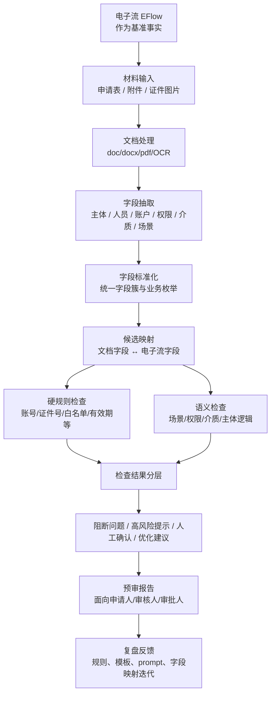
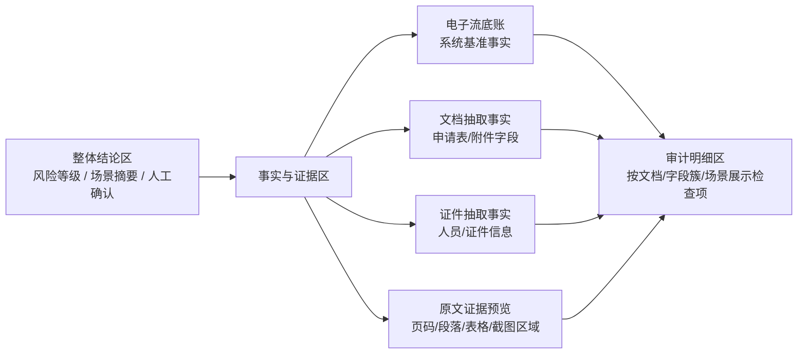

# 领导对标前思考记录：Demo 核心逻辑与前端报告页信息架构

**文档状态**：阶段性思考记录，待 2026-05-06 与领导对标后复盘补充。
**适用范围**：仅面向 `contract_handle` 项目当前 demo 和下一阶段方案讨论。
**记录时间**：2026-05-05
**重要提醒**：本文不是最终 PRD，也不是开发承诺。它用于先把当前共识、判断和待确认问题放在一起，避免后续讨论重新发散。

---

## 1. 当前 Demo 的核心业务定位

当前 demo 不应被理解为“AI 帮忙识别几个字段”，而应被理解为：

> 面向银行通道/网银权限申请材料的 AI 预审助手。它以电子流为业务基准事实，对申请材料中的主体、账户、权限、介质、人员、场景等要素进行解析、标准化、映射、检查和风险分层，帮助申请人、审核人、审批人在正式对外提交前提前发现问题。

这个定位有三个边界：

1. AI 做预审、整理、提示和聚焦，不替代审批责任。
2. 电子流是当前系统链路中的基准事实，银行申请表、附件、证件材料应围绕它进行一致性与风险检查。
3. 预审结果必须服务于作业质量和对外信息准确，而不是单纯追求自动化或技术炫技。

---

## 2. 业务能力地图

从第一性原理看，业务侧真正需要的是“外发银行材料前的作业质量控制”。因此能力可以拆成以下几类：

| 业务能力 | 解决的问题 | 主要面向角色 |
| --- | --- | --- |
| 业务事实基准 | 明确本次到底办什么、谁办、办哪个平台/账户/权限/介质 | 申请人、审核人 |
| 材料要素整理 | 把散落在申请表、附件、证件里的关键信息抽出来 | 申请人 |
| 要素标准化 | 把不同银行模板、不同叫法统一到同一套字段口径 | 申请人、审核人 |
| 要素一致性检查 | 判断文档与电子流、多份文档之间是否冲突 | 审核人 |
| 场景适配检查 | 判断开通、注销、变更、加挂等业务动作是否匹配 | 审核人 |
| 权限/账户/介质风险检查 | 判断是否超配、误销、少销、账户错配、介质处理不清 | 审核人、审批人 |
| 人工确认事项识别 | 把 AI 无法稳定判断的事项显式交给人 | 审核人 |
| 分层预审报告 | 输出阻断问题、高风险提示、人工确认项、优化建议 | 申请人、审核人、审批人 |
| 证据链回溯 | 每个结论能回到字段、文档、原文或规则依据 | 审核人、审批人 |
| 复盘与规则沉淀 | 从真实案例中补充规则、模板、字段映射 | 业务专家、产品团队 |

其中最核心的分界是：

> AI 不直接替人审批，而是帮助人快速知道“该看什么、哪里可能错、为什么需要确认”。

---

## 3. IT 功能模块地图

对应到系统能力，当前目标链路可以表达为：

模块拆解如下：

| 模块 | 当前应承担的职责 |
| --- | --- |
| 输入编排 | 接收电子流、银行申请文档、证件图片，多附件任务隔离 |
| 文档解析 | 解析 Word/PDF/图片，保留段落、表格、OCR 文本 |
| 结构化抽取 | 让 LLM 抽取统一业务结构，而不是绑定单个模板 |
| 统一数据模型 | 定义公司、平台、人员、账户、权限、介质、场景 |
| 硬规则检查 | 对账号、证件号、人员白名单、证件有效期做确定性校验 |
| 语义检查 | 对场景、权限范围、介质处理、字段映射歧义做判断 |
| 跨文档检查 | 比对多份材料之间是否互相冲突或缺失 |
| 汇总报告 | 聚合单文档结果，输出整体风险结论和人工确认项 |
| 前端呈现 | 让业务人员看到摘要、明细、风险层级、原因码 |
| 运营闭环 | 记录案例、错误、人工确认结果，反哺规则和 prompt |

---

## 4. 当前项目与目标思路的对齐情况

总体判断：

> 当前 demo 的主方向是对的，已经有“电子流作为基准事实”的预审雏形。但它现在更像“单文档逐件预审 + 汇总说明”，还没有完全成为“业务作业质量控制工作台”。

| 目标能力 | 当前项目状态 | 说明 |
| --- | --- | --- |
| 电子流作为基准事实 | 已实现主干 | 后端先解析 `eflow_json`，后续文档围绕 `EFlowData` 检查 |
| 多文档输入 | 已实现 | 支持多个银行文档和多个证件图片 |
| Word/PDF 解析 | 已实现基础版 | 支持 `.doc/.docx/.pdf`、段落和表格 |
| 图片证件识别 | 已实现基础版 | 接入 OCR/vision 路径 |
| 统一结构化抽取 | 已实现 | 使用 `global_document_extraction` 输出统一结构 |
| 场景识别 OPEN/CANCEL | 已有雏形 | 数据模型包含 `scenario_type/action_type/action_summary/evidence_summary` |
| 字段标准化 | 部分实现 | 有统一 schema，但模板字段到标准字段的映射主要依赖 prompt |
| 硬规则检查 | 部分实现 | 已覆盖公司证件号、人员白名单、账号绑定等 |
| 语义检查 | 已实现 prompt 版 | 单文档维度调用 `semantic_risk_analyzer` |
| 风险分层 | 已实现基础版 | 后端按 severity 汇总为整体风险等级 |
| 人工确认项 | 已实现基础版 | `manual_confirmation_required` 和前端展示已接入 |
| 跨文档交叉校验 | 尚未真正实现 | 当前 `cross_validator_checks` 还是空列表 |
| 原文定位/证据链 | 基本未实现 | 有 `detail/evidence` 字段，但缺页码、坐标、原文片段索引 |
| 角色化报告 | 部分实现 | 有统一报告和风险洞察，但尚未按申请人/审核人/审批人拆视图 |
| 反馈闭环 | 未实现 | 暂无人工确认结果回写、误报漏报复盘、规则命中统计 |

当前最值得保留的方向：

1. 继续坚持“电子流 = 基准事实”的判断框架。
2. 继续使用“硬规则 + 语义检查”的双层结构。
3. 继续将“人工确认项”作为高质量预审的必要分支，而不是把不确定事项伪装成确定结论。

当前最需要补齐的能力：

1. 跨文档检查层。
2. 证据链与原文定位。
3. 面向不同业务角色的报告组织方式。

---

## 5. 前端报告页面的三段结构

当前报告页可以理解为三个大的部分：

| 页面部分 | 当前承担的职责 | 当前成熟度 |
| --- | --- | --- |
| 1. 整体性报告总结与结论展示 | 给出总体风险等级、场景摘要、风险洞察、人工确认项 | 较明确 |
| 2. 文档 & 电子流信息整体预览 | 展示 EFlow 底账、文档抽取结果、证件抽取结果 | 价值定位偏尴尬 |
| 3. 基于文档 + 场景的审计细节 | 展示检查项、风险等级、字段簇、检查方式、原因码、差异值 | 较明确 |

第 1 部分回答的是：

> 这次预审总体怎么样？有没有明显风险？领导或审核人应该先看哪里？

第 3 部分回答的是：

> 具体哪份文档、哪个字段、哪条规则出了问题？

第 2 部分目前的问题在于，它既不像第 1 部分那样有结论，也不像第 3 部分那样有明确问题，因此容易变成“抽取结果堆叠区”。

---

## 6. 第 2 部分的主要价值应该是什么

第 2 部分不应该只是“预览字段”，它更适合被定义为：

> 事实底稿与证据工作台。

它的核心价值不是给出判断，而是帮助用户建立三种信任：

1. 系统到底读到了什么。
2. 系统是拿什么事实去做检查的。
3. 审计结论能不能回到具体材料和原文。

换句话说，第 2 部分不是结论层，也不是规则层，而是“事实层”。

更具体地说，它应该服务于以下几个业务动作：

| 业务动作 | 第 2 部分需要提供的支持 |
| --- | --- |
| 申请人自查 | 快速看到系统是否把材料读对了、字段抽对了 |
| 审核人复核 | 能比较电子流底账与文档抽取事实是否在同一口径下 |
| 审批人追问 | 当看到高风险结论时，可以回到原始材料证据 |
| 误判排查 | 如果 AI 判断错了，可以快速定位是 OCR 错、抽取错、映射错还是规则错 |
| 后续调优 | 产品/IT 可以知道问题来自模板解析、prompt、字段模型还是规则体系 |

因此，第 2 部分建议从“信息预览区”升级为“事实与证据区”。

---

## 7. 第 2 部分建议的信息架构

建议第 2 部分未来不再只是三列字段展示，而是拆成四个层次：

| 层次 | 页面表达 | 说明 |
| --- | --- | --- |
| 事实摘要 | 本次电子流、文档、证件各自识别出的核心对象 | 用于快速判断系统是否读懂了本次业务 |
| 字段对齐 | EFlow 字段、文档字段、证件字段的并列表达 | 用于建立统一口径 |
| 原文证据 | 字段来自哪份文档、哪一段、哪一行、哪一页 | 用于支持审计结论 |
| 解析置信与异常 | 哪些字段为空、低置信、疑似 OCR/抽取错误 | 用于区分“材料错”和“AI 没读准” |

一个更理想的布局可以是：

---

## 8. 是否应该增加原文部位或原文内容预览

初步判断：应该增加，而且这可能是从 demo 走向可信方案的关键能力之一。

原因是：

1. 审计结论如果不能回到材料来源，业务人员很难放心。
2. 高风险问题需要“有的放矢”，否则审核人仍然要从头翻材料。
3. AI 预审系统的常见风险不是“没有结论”，而是“结论看起来像真的但无法核验”。
4. 面向银行外发材料时，可追溯性比一般文本总结场景更重要。

原文预览不一定第一阶段就做成复杂的 PDF 坐标高亮，可以分阶段：

| 阶段 | 能力 | 实现复杂度 | Demo 价值 |
| --- | --- | --- | --- |
| P0 | 展示 LLM 抽取依据摘要、原始解析文本 | 低 | 可以立即增强可信度 |
| P1 | 每个字段保留来源文档、来源段落/表格行 | 中 | 明显提升审核效率 |
| P2 | 支持点击检查项跳转到原文片段 | 中 | 把第 2 部分和第 3 部分打通 |
| P3 | PDF/图片区域高亮、页码坐标定位 | 高 | 更接近正式产品 |
| P4 | 人工确认后回写字段级反馈 | 高 | 进入运营闭环 |

当前 demo 下周要展示时，不建议一口气做 P3/P4。更现实的是先设计成：

> 检查项旁边提供“查看依据”，点击后展示该字段的来源文档、抽取值、电子流值、相关原文片段或 LLM evidence_summary。

这样对业务表达最有帮助，复杂度也不会突然失控。

---

## 9. 对当前前端第 2 部分的定位建议

建议把当前第 2 部分从：

> EFlow 业务底账 / 文档解析对齐 / 证件提取对齐

调整为更业务化的表达：

> 事实底稿与材料证据

内部可以保留三栏，但每栏的职责要更清晰：

| 子区 | 建议名称 | 价值 |
| --- | --- | --- |
| EFlow 栏 | 电子流基准事实 | 说明系统认为本次业务的标准事实是什么 |
| 文档栏 | 申请材料抽取事实 | 说明系统从银行材料里读到了什么 |
| 证件栏 | 身份/证件抽取事实 | 说明证件材料中识别出的人员与证件信息 |

再增加一个轻量能力：

| 能力 | 页面表现 |
| --- | --- |
| 字段来源 | 每个关键字段旁边标记来源文档或来源类型 |
| 原文预览 | 点击“查看依据”展示原文片段、表格行或 OCR 文本 |
| 风险关联 | 如果某字段参与了风险检查，显示“关联 X 条检查项” |
| 空值提示 | 对缺失字段标记“未识别/材料未填写/不适用” |

这样第 2 部分就不再尴尬，而是成为第 1 部分和第 3 部分之间的桥梁：

> 第 1 部分给结论，第 2 部分给事实，第 3 部分给检查逻辑。

---

## 10. 领导对标后的待复盘问题

明天对标后建议重点确认以下问题：

1. 领导更关心“外发材料准确性”还是“审批效率提升”，两者优先级如何排序。
2. 对阻断问题、高风险提示、人工确认项、优化建议这四类分层是否认可。
3. 电子流是否可以被明确视为当前预审的基准事实，还是存在某些场景下电子流本身也需要被反查。
4. 哪些错误属于绝对不能外发的红线问题。
5. 哪些问题适合 AI 自动判断，哪些必须保留人工确认。
6. 是否需要区分申请人、审核人、审批人的不同报告视角。
7. 原文证据链做到什么程度才足以支撑 demo 或后续立项。
8. 是否需要在前端明确展示“AI 置信度/解析不确定性”，避免用户误以为系统已经完全确认。
9. 跨文档检查是否是下一阶段必须项，还是可以等真实材料样本更多后再做。
10. 后续产品化时，人工确认结果是否需要沉淀为规则反馈和模型/prompt 调优依据。

---

## 11. 当前建议的短期动作

在不大规模重构的前提下，短期更适合做三件事：

1. 把前端报告页的文案与结构重新命名，让业务人员理解三段逻辑：结论、事实、检查。
2. 在检查明细中补充“查看依据/查看原文”的入口，先用现有 raw_text、evidence_summary、source_a/source_b 支撑。
3. 梳理一份“字段到证据”的轻量数据结构草案，为后续原文定位和跨文档检查预留接口。

这些动作能增强 demo 的可信度，同时不会把当前系统复杂度推得太高。
