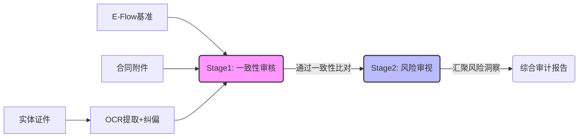

# 银行预审系统 V3.1：深度架构与分层审计逻辑

## 1. 核心流程演进 (Processing Flow)

## 2. 详细审计决策层级 (Audit Decision Layers)

### Stage 1: 一致性审核 (Consistency)
| 维度 | 逻辑 | 技术锚点 |
| :--- | :--- | :--- |
| **基础信息** | 1:1 或 1:N 硬比对 | hard_comparator.py |
| **业务意图** | 语义动作对齐 (开通/变更) | comparator.py |
| **三方对齐** | 系统 vs 纸面 vs 证件 | reporter.py |

### Stage 2: 风险审视 (Risk Insight)
| 风险点 | 审计策略 | 语义提取模型 |
| :--- | :--- | :--- |
| **权限合规** | 四方权限 (审/支/查/传) 映射 | extractor.py |
| **限额风险** | 数值区间合规判定 | semantic_check |
| **介质冲突** | Token/U盾重复领用预警 | cross_validation |

---

## 3. 技术卡点与解决方案总结

> [!TIP]
> **关于护照持证人显示 "P" 的最终解法**
> 我们发现传统的 OCR 往往会先读到顶部的 'P'。V3.1 方案在 `ocr_service.py` 中引入了 ` n != "P" and len(n) > 1` 的拦截器。一旦拦截，会通过 `id_extraction_fallback` 提示词显式指引模型：“**请盯着最底下的机器码（MRZ）看，忽略顶部的 P**”。

> [!IMPORTANT]
> **端到端性能加速 (Concurrency)**
> 针对多附件场景，系统在保持 LLM 语义链条串行（保质）的基础上，实现了证件颗粒度的并发扫描（提速），多证件任务总耗时缩减约 40%。
