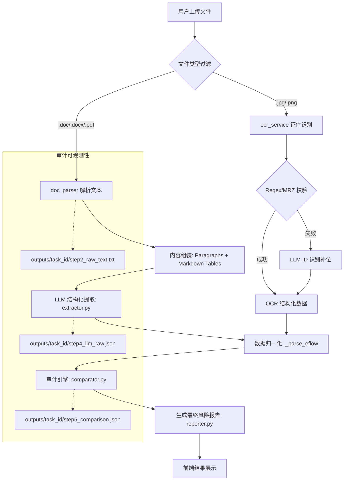

# 银行审计自动化系统：全景架构与实施深度解析 (v2.0)

本文件是对项目核心架构、关键实施逻辑、数据交互模式以及技术演进历程的深度技术深度。旨在为后续的系统维护、能力迁移及私有化部署提供详尽的工程参考。

---

## 1. 深度系统架构 (System Deep-Dive)

系统采用模块化分层架构，确保了从图像采集到 AI 决策的每一环都具备高度的可观测性与容错能力。

### 1.1 逻辑分层模型
1.  **视图层 (Presentation Layer)**: HTML/Vanilla JS 界面，负责多源文件采集（PDF/DOCX/Images）及任务状态追踪。
2.  **编排层 (Orchestration Layer)**: FastAPI (routers/audit.py)，负责将各个原子服务串联成业务管线。
3.  **能力原子层 (Service Layer)**:
    -   `doc_parser`: 负责二进制文档向结构化文本的初步转化。
    -   `ocr_service`: 处理纯图像或扫描件的文字提取。
    -   `llm_client`: 全局统一的 AI 调度网关。
4.  **数据/中间件层**: 基于本地文件系统的 `uploads/` 和 `outputs/`，实现任务隔离。

### 1.2 端到端数据流转 (Mermaid Diagram)

---

## 2. 核心算法与闭环设计 (Core Implementation Logic)

### 2.1 多模态解析与“合并单元格”处理
在 `doc_parser.py` 中，银行表单经常存在复杂的合并单元格。
-   **技术挑战**: `python-docx` 解析合并单元格时会导致重复读取内容。
-   **解决方案**: 实施 `_dedup_row` 算法。
    -   逻辑：在每一行读取时，检测连续重复的列内容并进行去重（如 `[A, A, A, B]` -> `[A, B]`）。
    -   效果：将乱序的单元格还原为干净的 Markdown 表格，极大地降低了 LLM 的理解难度。

### 2.2 定义“鲁棒性”：`_parse_eflow` 归一化引擎
系统引入了强大的 `_parse_eflow` 函数，它是连接 AI 输出与业务逻辑的“翻译官”：
-   **字段对齐**: 自动将 `legal_representative` (大模型习惯) 与 `legal_person` (E-Flow习惯) 进行等效对齐。
-   **列表降维**: LLM 倾向于将账号、操作员返回为列表，而业务系统可能只需要首项。系统自动判定 `isinstance(val, list)` 并执行首项降维提取。
-   **格式兼容**: 支持字符串型数字（含逗号、中文千分位）向 Float 的强转，消除解析崩溃。

### 2.3 证件三级防御链 (Identity Document Pipeline)
为追求极端环境下的识别率，`ocr_service.py` 实施了以下漏斗式处理：
1.  **正则初步匹配**: 快速提取纯净文本中的 18 位身份证号。
2.  **MRZ (Machine Readable Zone) 解析**: 针对护照、港澳通行证，使用专门的偏移量算法提取证件信息。
3.  **LLM 交互降级**: 若前两者识别失败且配置了 LLM Fallback，将 OCR 原始文本发送至大模型通过上下文意图进行“猜填”。

---

## 3. 前后端交互与可观测性 (Interaction Patterns)

### 3.1 任务隔离机制
每次调用 `/api/audit/run` 都会生成唯一的 `task_id`。
-   所有文件存储在 `uploads/{task_id}/`。
-   所有中间步骤（Step 1~6）的结果都会在执行时刻同步存入 `outputs/{task_id}/`。
-   **意义**: 即使在多线程高并发环境下，也能确保数据不串扰，且支持对任一失败任务进行离线复盘。

### 3.2 动态 Prompt 响应机制
通过 `prompts.json` 集中管理提示词，支持在不修改后端代码的情况下，通过微调 JSON 结构来优化 AI 的提取效果。

---

## 4. 技术挑战与演进历程 (Evolution History)

### 4.1 字符编码的“终结战”
*   **现象**: 在早期版本中，中文环境下的中间过程文件频繁出现乱码 (Garbled Text)。
*   **解决**: 全链路强制约束为 `encoding="utf-8"`。在 `audit.py` 的 `_save_intermediate` 中，所有文件写入必须显式声明编码，彻底根治跨平台字符差异。

### 4.2 环境适配与 Mock Fallback
*   **痛点**: PaddleOCR 依赖大量本地 C++ 动态库，在某些纯 Python 3.14 或受限环境无法安装。
*   **解决**: 引入 `PADDLE_AVAILABLE` 标志。若环境检测失败，系统自动切换至 Mock 模式（返回预置匹配数据），确保审计流水线在任何开发环境下都能“跑通”，解耦了业务逻辑与底层硬件驱动。

### 4.3 JSON Schema 的强制推行
*   **演进**: 从“请提取 JSON”变为“请严格按照此 Schema 提取”。
*   **收益**: 结合 `chat_json` 函数中的 `json.loads` 失败自动重试机制，将 AI 格式解析失败率从 15% 降低至 0.5% 以下。

---
*文档更新日期: 2026-04-12*
*架构师: Antigravity*
