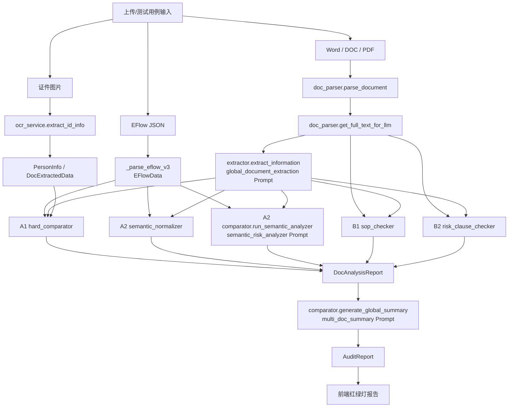

# 后端提取与检查分层方案

**文档定位**：记录当前 demo 已真实实施的后端提取、检查、规则配置和 Prompt 链路，供产品、业务、IT 实施团队理解现状和继续拆解。

**更新时间**：2026-05-12

**适用范围**：`contract_handle` 银行通道/网银权限材料 AI 预审 demo。

**当前状态**：已从“一个抽取 Prompt + 一个语义检查 Prompt”的粗链路，落地为“两层四块 + 红绿灯结果”的混合检查体系。

---

## 1. 后端真实目标

本项目后端不是泛化文档问答，也不是单纯 OCR 抽字段。它要完成的是：

> 以电子流 EFlow 为本次办理的基准事实，读取银行申请材料、附件和证件，提取可比对要素，再用确定性规则、语义归一、SOP 检查和风险词库扫描，输出业务人员能理解、能复核、能看依据的预审结果。

后端必须遵守三个边界：

1. AI 是辅助预审，不替代审批，不做流程控制点。
2. 检查结论使用“建议复核、建议确认、建议补充或修正”，避免“阻断、不可提交、放行”等控制性措辞。
3. 不确定事项必须显性进入“审核人确认”，不能包装成确定通过或确定错误。

---

## 2. 当前主链路

真实入口在 `backend/routers/audit.py` 的 `_run_pipeline()`。



当前每份 Word/PDF 文档会依次执行：

1. 文档解析，形成全文文本。
2. LLM 抽取，形成 `DocExtractedData`。
3. A1 确定性比对。
4. A2 配置化语义归一。
5. A2 LLM 语义检查。
6. B1 SOP 文档自身合规与合理性检查。
7. B2 高风险条款扫描。
8. 写入 `DocAnalysisReport.hard_checks / semantic_checks`。

证件图片会执行：

1. OCR/Vision 识别姓名、证件号、有效期。
2. 构造成 `DocExtractedData(source_type="ocr")`。
3. 执行 A1 人员白名单、证件格式、证件有效期等检查。

---

## 3. 数据结构现状

核心结构在 `backend/models/schemas.py`。

### 3.1 输入结构

| 结构 | 作用 | 当前主要字段 |
| --- | --- | --- |
| `EFlowData` | 电子流基准事实 | `business_type`、`business_scenario`、`platform`、`company`、`applicant`、`users` |
| `DocExtractedData` | 单份文档/证件抽取事实 | `business_activity`、`scenario_type`、`action_type`、`platform`、`company`、`persons`、`users`、`raw_text` |
| `UserPermission` | 单用户/账号/权限/介质单元 | `user_name`、`permission_scope`、`account_number`、`account_name`、`account_status`、`media`、`single_limit`、`daily_limit` |
| `PermissionScope` | 权限范围归一 | `authorize`、`payment`、`query`、`upload`、`raw_text` |
| `MediaInfo` | 介质信息 | `media_type`、`media_number`、`existing_media`、`needs_cancellation` |

### 3.2 输出结构

`CheckResult` 是前后端承接检查结果的核心结构。

| 字段 | 当前含义 |
| --- | --- |
| `check_name` | 检查项业务标题原始值 |
| `category` | 检查分类，如核心信息一致性、材料合规、风险条款 |
| `check_layer` | 两层之一：`EFLOW_BASED` / `DOCUMENT_ONLY` |
| `check_block` | 四块之一：`A1_EXACT` / `A2_SEMANTIC` / `B1_SOP` / `B2_RISK_CLAUSE` |
| `field_group` | 字段簇：`account`、`subject`、`permission`、`media`、`business_scenario` 等 |
| `field_name` | 具体字段名 |
| `source_a_label/value` | 基准侧信息，通常为 EFlow 或业务规则 |
| `source_b_label/value` | 材料侧信息，通常为文档抽取或全文命中 |
| `result` | `MATCH`、`MISMATCH`、`MISSING`、`REVIEW` 等 |
| `severity` | 内部严重程度：`PASS`、`INFO`、`WARNING`、`CRITICAL` |
| `manual_confirmation_required` | 是否需要审核人确认 |
| `traffic_light` | 前端业务红绿灯：`GREEN`、`YELLOW`、`RED` |
| `business_status` | 前端业务状态：`PASS`、`REVIEW`、`NEED_FIX` |
| `confidence` | 规则/模型判断置信度 |
| `requires_config_review` | 是否适合沉淀为配置或规则候选 |
| `requires_engineering_change` | 是否疑似需要工程版本解决 |

### 3.3 红绿灯归类逻辑

统一逻辑在 `backend/services/check_taxonomy.py` 的 `tag_check()`：

```python
if severity == PASS:
    traffic_light = GREEN
elif manual_confirmation_required:
    traffic_light = YELLOW
else:
    traffic_light = RED
```

对应业务解释：

| 红绿灯 | 业务含义 | 前端展示 |
| --- | --- | --- |
| `GREEN` | 已按现有规则确认一致，或未发现明显异常 | 绿灯通过 |
| `YELLOW` | 当前材料信息不足、语义不确定，或需结合业务背景判断 | 审核人确认 |
| `RED` | 发现与电子流、材料规范或风险词库不一致 | 发现不一致 / 建议优先复核 |

---

## 4. 两层四块真实实施逻辑

## 4.1 第一层：电子流中已有，且文档应承载的信息

第一层回答：

> 材料是否正确反映了电子流里已经登记的基准事实？

这一层包括 A1 和 A2。

### A1：核心信息一致性检查（确定性规则）

**代码位置**：`backend/services/hard_comparator.py`
**结果标签**：`check_layer=EFLOW_BASED`，`check_block=A1_EXACT`
**设计原则**：只要能用代码稳定判断，就不交给模型主观判断。

当前已实现检查：

| 检查项 | 数据来源 | 主要规则 | 输出倾向 |
| --- | --- | --- | --- |
| 公司证件号精确比对 | EFlow 公司证件号 vs 文档公司证件号 | 去空格、横杠、大小写后比对 | 不一致为红灯 |
| 网银平台名称核对 | EFlow 平台/银行名称 vs 文档平台/银行名称 | 名称清洗后允许包含关系 | 不一致为红灯 |
| OCR 证件实体归属 | EFlow 申请人/用户池 vs OCR 人员 | 证件号或姓名命中任一即可 | 未命中为黄灯 |
| 身份证号码格式核对 | OCR 证件号码 | 18 位，末位 X 大写 | 格式异常为黄灯 |
| 操作员对象匹配 | EFlow 用户对象 vs 文档用户对象 | 按姓名、账号、介质编号、角色综合打分配对 | 稳定匹配为绿灯 |
| EFlow 用户缺失检查 | EFlow 用户对象 vs 文档用户对象 | EFlow 有用户但材料中未稳定匹配 | 黄灯 |
| 文档额外用户检查 | 文档用户对象 vs EFlow 用户清单 | 材料出现未能与 EFlow 匹配的用户 | 黄灯 |
| 操作员账号绑定校验 | EFlow 用户账号 vs 文档用户账号 | 支持逗号/顿号/换行分隔的多账号集合交集比对 | 不一致为红灯 |
| 操作员权限范围核对 | EFlow 用户权限 vs 文档用户权限 | 逐用户比较授权、支付、查询、上传四类权限 | 超出红灯，缺失黄灯 |
| 账户名称核对 | EFlow 户名 vs 文档户名 | 去掉常见账户类型后缀，支持 Ltd/Inc 简化 | 不一致为红灯 |
| 账户英文名称核对 | EFlow 英文户名 vs 文档英文户名 | 英文大小写、标点、常见缩写归一 | 不一致为红灯 |
| 账户状态核对 | EFlow 账户状态 | 识别注销、冻结、挂失、停用等异常 | 异常为黄灯 |
| 权限限额核对 | EFlow 限额 vs 文档限额 | 单笔/日限额数值比对 | 不一致为红灯 |
| 介质编号核对 | EFlow 介质编号 vs 文档介质编号 | 清洗后精确比对 | 不一致为红灯 |
| 证件有效期核查 | OCR 有效期 vs 当前日期 | 已过期则提示 | 过期为红灯 |

当前 A1 的实现特点：

- 更适合处理账号、证件号、介质号、公司信用代码这类不可主观解释的字段。
- 目前仍依赖 LLM 抽取结果的准确性；如果字段没有抽出来，A1 不会强行制造检查项。
- 已支持一份材料中多名操作员的基础对象配对，并能识别 EFlow 有/材料缺、材料有/EFlow 缺的用户对象。
- 当前仍未把 `UserPermission` 进一步拆成 `accounts[] / activities[] / permission_items[]` 等更细层级；一人多账号、一人多动作仍以逗号分隔字段和单对象承载，产品化阶段需要继续拆细。

### A2：文档字段理解与语义映射转换

**代码位置**：

- `backend/services/semantic_normalizer.py`
- `backend/services/comparator.py`
- `backend/rules/semantic_mappings.json`

**结果标签**：`check_layer=EFLOW_BASED`，`check_block=A2_SEMANTIC`
**设计原则**：先用业务确认过的映射表做轻量归一，再让 LLM 处理上下文语义和异常场景。

当前 A2 分为两段：

1. 配置化语义归一：`semantic_normalizer.py`
2. LLM 语义检查：`comparator.run_semantic_analyzer()`

#### A2.1 配置化语义归一

配置文件：`backend/rules/semantic_mappings.json`

当前配置覆盖四类：

| 配置组 | 归一目标 | 示例 |
| --- | --- | --- |
| `scenario` | `OPEN / CANCEL / MODIFY` | 开通、开立、新增、启用 -> `OPEN`；注销、撤销、停用 -> `CANCEL` |
| `action` | `OPEN_PERMISSION / CANCEL_PERMISSION / OPEN_MEDIA / CANCEL_MEDIA` | 开通权限、注销权限、申领介质、注销证书 |
| `permission_scope` | `authorize / payment / query / upload` | 授权、审批、复核 -> `authorize`；付款、转账 -> `payment` |
| `media_type` | `USB_KEY / TOKEN / CERTIFICATE` | U盾、USB Key、Token、OTP、数字证书 |

当前已实现检查：

| 检查项 | 逻辑 | 输出 |
| --- | --- | --- |
| 办理事项语义归一检查 | EFlow 场景与文档场景归一后比较 | 一致绿灯，不一致红灯，无法识别黄灯 |
| 权限范围语义检查 | 将文档权限归一为四类，与 EFlow 权限比较 | 文档超出 EFlow 为黄/红，缺失为黄 |
| 办理动作语义复核 | 比较开通/注销权限、开通/注销介质等动作 | 不一致黄灯 |
| 介质类型语义复核 | 比较 U盾/Token/证书等介质类型 | 不一致黄灯 |

#### A2.2 LLM 语义检查

Prompt：`semantic_risk_analyzer`
作用：当结构化映射不足以判断时，由 LLM 基于 EFlow 与 `DocExtractedData` 做单文档语义检查。

当前 LLM 会重点检查：

- 业务场景是否一致。
- 申请人、名义用户、持有人是否一致。
- 权限范围是否超配、少销、误销。
- 介质是否缺失、是否注销、是否与系统已有介质一致。
- 账户状态、平台对象是否缺失或不适配。

需要注意：

- 当前 LLM A2 仍可能产生与配置化 A2 重复的检查项。
- 产品化时建议进一步收窄 Prompt，让它只补充规则无法覆盖的语义判断。

## 4.2 第二层：电子流没有，但文档需要业务关注的信息

第二层回答：

> 即使电子流没有这个字段，材料自身是否存在作业规范或风险表述上的问题？

这一层包括 B1 和 B2。

### B1：SOP 作业规范与材料自身合理性检查

**代码位置**：

- `backend/services/sop_checker.py`
- `backend/rules/sop_rules.json`

**结果标签**：`check_layer=DOCUMENT_ONLY`，`check_block=B1_SOP`
**设计原则**：只提示业务复核，不把 SOP 检查包装成自动控制。

当前规则配置：

```json
{
  "placeholder_tokens": ["待填", "N/A", "NA", "TBD", "XXX", "请填写"],
  "business_conflicts": {
    "OPEN": ["注销", "撤销", "停用", "取消权限", "关闭权限", "Terminate", "Cancel"],
    "CANCEL": ["开通", "新增", "启用", "申请开立", "申请开通", "Add", "Open"]
  },
  "date_formats": ["YYYY-MM-DD", "YYYY年MM月DD日"],
  "currency_tokens": ["元", "人民币", "CNY", "RMB", "USD", "美元", "EUR", "欧元", "HKD", "港币"],
  "allowed_email_suffixes": []
}
```

当前已实现检查：

| 检查项 | 实现逻辑 | 输出 |
| --- | --- | --- |
| 必填信息完整性复核 | 扫描明确占位符，如 `待填/N/A/TBD/XXX/请填写` | 命中为黄灯；未命中给绿灯底稿 |
| 联系方式格式复核 | 只在“手机/电话/Phone/Mobile/Tel”等锚定词附近识别疑似号码 | 格式异常黄灯 |
| 工号格式复核 | 只在“工号/员工号/Employee ID/Staff ID”等锚定词附近识别数字 | 非 8 位黄灯 |
| 办理事项实质冲突复核 | EFlow 为开通时全文出现注销/停用等反向词，或反之 | 当前实现为红灯或黄灯复核 |
| 权限组合合理性复核 | 同一用户同时包含授权和支付等高敏权限 | 黄灯 |
| 权限限额币种复核 | 文档识别到限额，但未稳定识别币种单位 | 黄灯 |
| 邮箱后缀复核 | 仅当配置了 `allowed_email_suffixes` 才启用 | 黄灯 |

本轮实施中特别收窄了 B1 的触发方式：

- 不再把所有长数字都当手机号或工号。
- 电话/工号只有靠近明确锚定词时才检查。
- `NA` 只按独立词匹配，避免命中英文单词片段。

这样做是为了减少 demo 中“风险太多、人看不过来”的问题。

### B2：高风险条款/关键词扫描

**代码位置**：

- `backend/services/risk_clause_checker.py`
- `backend/rules/risk_clauses.json`

**结果标签**：`check_layer=DOCUMENT_ONLY`，`check_block=B2_RISK_CLAUSE`
**设计原则**：命中风险表达后提示“请重点审核该条款”，不替代业务判断。

当前风险词库：

```json
{
  "high_risk_phrases": [
    "无限连带责任",
    "全部责任",
    "无条件",
    "不可撤销",
    "不可抗辩",
    "自动续期",
    "自动顺延",
    "无需另行通知",
    "长期有效",
    "银行单方变更权限",
    "单方终止协议",
    "单方调整费率",
    "最终解释权归银行所有",
    "银行不承担任何责任"
  ]
}
```

当前 B2 行为：

- 扫描文档全文、抽取 raw_text 和 evidence_summary。
- 每个风险短语只命中一次，避免重复刷屏。
- 输出红灯，业务状态为 `REVIEW`。
- `source_a_value` 放风险词，`source_b_value/evidence` 放上下文片段。

---

## 5. 关键 Prompt 现状

Prompt 配置文件：`backend/prompts/prompts.json`

当前共有四个关键 Prompt：

1. `global_document_extraction`
2. `semantic_risk_analyzer`
3. `multi_doc_summary`
4. `id_extraction_fallback`

### 5.1 文档结构化抽取 Prompt

**键名**：`global_document_extraction`
**调用位置**：`backend/services/extractor.py`
**输入**：单份 Word/PDF 解析后的全文文本
**输出**：兼容 `DocExtractedData / UserPermission / MediaInfo` 的 JSON
**职责边界**：只抽取事实，不做最终风险判断。

当前核心提示词：

```text
你是一个面向银行网银权限/通道办理材料的智能预审抽取器。你的任务不是泛泛摘要，而是把单份申请文档中的关键业务事实抽取成稳定结构，供后续规则检查使用。

【总原则】
1. 先识别当前办理场景，再抽字段。
2. 本次常见场景只有两大类：OPEN（开通/新增/加挂）与 CANCEL（注销/取消/撤销/停用）。如果无法判断，则填 UNKNOWN。
3. 识别本次动作类型 action_type，候选值：OPEN_PERMISSION, CANCEL_PERMISSION, OPEN_MEDIA, CANCEL_MEDIA, UNKNOWN。
4. 对同一文档中的用户、权限、介质、账号，尽量保留它们之间的对应关系。
5. 不要编造缺失信息。无法确认时置空、设 false 或给 UNKNOWN。

【重点抽取任务】
1. 场景与动作
- 识别业务动作 business_activity
- 识别 scenario_type
- 识别 action_type
- 用一句简短中文给出 action_summary
- 用一句简短中文概括 evidence_summary，说明你为什么这样判断场景/动作

2. 公司与主体
- 提取公司名称、证件号
- 提取申请人/名义用户/持有人等用户信息，尽量放入 users 或 persons 中

3. 权限与权限子类
- 提取 permission_sub_type
- 将文档中的原始权限表述归一到四大权限：authorize(授权/复核/审批), payment(支付/转账/付款), query(查询/明细), upload(上载/导入)
- 把原始权限表述保留在 permission_scope.raw_text
- 如文档明显表达“注销权限/保留权限/不处理权限”，可在 action_on_permission 填 OPEN / CANCEL / KEEP / UNKNOWN

4. 介质
- 提取介质类型、介质编号、是否空白介质、是否实体介质、已有介质信息
- 如文档明确表达“是否注销介质”，填写 media.needs_cancellation
- 如能判断该用户对介质的动作，填写 action_on_media: OPEN / CANCEL / KEEP / UNKNOWN

5. 账户
- 提取账号、账户名称、限额等

【多对象抽取要求】
- 如果同一份材料中出现多名操作员、经办人、复核员、授权人、持有人，必须尽量拆成多个 users，不要合并成一个用户。
- 如果同一名用户绑定多个账号，可暂时将多个账号保留在 account_number 中并用逗号分隔；如果不同用户对应不同账号，必须分别放入各自的 user 对象。
- 如果同一用户同时涉及权限动作和介质动作，应分别填写 action_on_permission 与 action_on_media。
- 如果材料是多级权限或多人复核链路，permission_sub_type 应保留角色名称，例如制单员、复核员、授权员、Supervisor、Operator。
```

### 5.2 单文档语义检查 Prompt

**键名**：`semantic_risk_analyzer`
**调用位置**：`backend/services/comparator.py`
**输入**：EFlow 基准 + 单份文档结构化抽取结果
**输出**：`semantic_checks` JSON 列表
**职责边界**：当前用于 A2 语义检查兜底，不建议继续扩大到 B1/B2。

当前核心提示词：

```text
你是一个专业的银行材料预审审查器。你会拿到【系统 EFlow 标准】和【单份文档的结构化抽取结果】，你的任务是按字段簇输出更可复核的检查结论，而不是泛泛评论。

【角色边界】
- 本系统是辅助预审工具，不是流程控制点，不做拦截、阻断或自动审批结论。
- severity 只是内部风险等级编码；detail/check_name 面向业务用户时，应使用“重点复核、风险提示、建议确认、建议补充/修正”等表述，避免使用“不可提交、阻断、放行、拦截”等控制性措辞。

【总要求】
1. 每条检查都必须显式给出：field_group, field_name, scenario_type, check_mode, reason_code, manual_confirmation_required。
2. field_group 只能取以下之一：business_scenario, subject, permission, media, account, platform。
3. check_mode 只能取以下之一：consistency, completeness, reverse_review, compliance_review, manual_confirmation。
4. 当你无法高置信判断，但发现材料存在遗漏、歧义、轻度矛盾时，不要强行输出 PASS/MISMATCH，请输出一条需要人工确认的检查项，并将 manual_confirmation_required 设为 true。

【核心检查框架】
一、业务场景 business_scenario
- OPEN 场景：文档应表现为开通/新增/加挂
- CANCEL 场景：文档应表现为注销/取消/撤销/停用
- 若系统与文档场景明显冲突，属于 CRITICAL，但业务表述应为“建议重点复核场景冲突”

二、主体 subject
- 核对申请人、名义用户、持有人、当前持有人是否与系统对象一致
- 如联系人是否等价于申请人无法稳定判断，输出 manual_confirmation

三、权限 permission
- 文档权限必须归一到四大权限：authorize, payment, query, upload
- OPEN 场景重点检查：是否超配、是否冗余、是否与业务场景不匹配
- CANCEL 场景重点检查：是否少销、误销、对错对象、范围不准

四、介质 media
- 检查文档中的介质类型、编号、是否空白介质、是否注销介质
- OPEN 场景重点检查：文档介质与系统已有介质是否一致、是否存在介质遗漏
- CANCEL 场景重点检查：系统存在介质时，文档是否明确写清是否注销；若系统有介质但文档缺失或写“无需注销”，通常至少应人工确认

五、账户 account
- 核对账号、账户名称、账户状态
- 如系统状态不支持当前动作，输出 reverse_review

六、平台 platform
- 如文档平台对象与系统明显不一致，输出 WARNING 或 CRITICAL
- 如平台识别不充分，输出 manual_confirmation
```

### 5.3 全局总结 Prompt

**键名**：`multi_doc_summary`
**调用位置**：`backend/services/comparator.py`
**输入**：所有 `DocAnalysisReport` + cross checks
**输出**：`overall_status`、`scenario_summary`、`aggregator_summary`、`risk_insights`、`manual_confirmation_items`
**职责边界**：只做综合归纳，不应新增过多检查项。

当前核心提示词：

```text
你是一个资深的银行预审风险汇总官。你拿到的是整次会话的文档检查结果，你的任务不是重复列举检查项，而是形成一份适合业务申请人、审核人、审批人阅读的综合审查结论。

【角色边界】
- 本系统是辅助预审工具，不是流程控制点，不做拦截、阻断或自动审批结论。
- 输出应使用“建议复核、重点关注、建议补充/修正、需人工确认”等辅助性表述，避免使用“不可提交、阻断、放行、拦截”等控制性措辞。

【输出重点】
1. 用一句简短的话总结本次业务场景：是开通还是注销，涉及哪些对象。写入 scenario_summary。
2. 写一段整体性概述 aggregator_summary：概括文件数、涉及平台、主要用户、核心权限、介质、账户对象。
3. 输出 overall_status：ZERO_RISK / LOW_RISK / MED_RISK / HIGH_RISK。
4. 输出 risk_insights：只保留最关键的风险洞察，不要流水账。
5. 输出 manual_confirmation_items：专门列出建议人工确认或重点复核的事项。

【汇总规则】
- 如果存在严重场景冲突、权限超配、注销错对象、关键账户冲突，整体应偏 HIGH_RISK，并表述为“建议重点复核”。
- 如果主要是信息遗漏、介质信息缺失、对象映射歧义，则可偏 MED_RISK，并放入 manual_confirmation_items。
- 如果整体基本一致，仅有轻微信息偏差，可为 LOW_RISK。
```

### 5.4 证件信息兜底抽取 Prompt

**键名**：`id_extraction_fallback`
**调用位置**：`backend/services/ocr_service.py`
**输入**：OCR 文本
**输出**：姓名、证件号、有效期
**职责边界**：只抽取证件信息，禁止构造公司、银行账号等无关字段。

当前核心提示词：

```text
你是一个专业的证件信息提取专家。你的任务是从 OCR 文本中精准提取身份信息。

【隔离指令】：身份证、护照等证件通常不包含公司信息和具体的银行账号信息，严禁从中尝试提取或构造此类字段。

【护照特别指令】：
1. 仔细观察文本底部是否存在类似 'P<CHNNAME<<STREET' 的机器读取区(MRZ)。
2. 机器读取区的第一行包含姓名，格式通常为 '姓<<名'，请将其翻译为标准的持证人姓名。
3. 忽略顶部的单字母 'P'（那是 Passport 类型）。

请严格返回 JSON: {"name": "...", "id_number": "...", "expiry_date": "YYYY-MM-DD"}
```

---

## 6. 前端如何消费后端检查结果

当前前端在 `frontend/app.js` 中读取所有检查项，并按 `traffic_light` 做互斥统计。

```text
共检查 = 绿灯通过 + 审核人确认 + 发现不一致
```

前端关键函数：

| 函数 | 作用 |
| --- | --- |
| `collectAllCheckItems()` | 汇总所有文档和跨文档检查项 |
| `trafficLight()` | 优先读取后端 `traffic_light`，没有则兼容旧字段 |
| `collectCheckStats()` | 统计 total / green / yellow / red |
| `checkBlockLabel()` | 将 `A1/A2/B1/B2` 翻译为业务检查范围 |
| `renderCheckOverviewBoard()` | 渲染红绿灯统计和分组表格 |
| `showEvidence()` | 展示电子流侧、文档侧、来源文件、原文片段和技术信息 |

当前展示层逻辑：

| 后端字段 | 前端业务表达 |
| --- | --- |
| `traffic_light=GREEN` | 绿灯通过 |
| `traffic_light=YELLOW` | 审核人确认 |
| `traffic_light=RED` | 发现不一致 |
| `check_block=A1_EXACT` | 关键信息一致性 |
| `check_block=A2_SEMANTIC` | 业务语义理解 |
| `check_block=B1_SOP` | 材料合规合理性 |
| `check_block=B2_RISK_CLAUSE` | 风险条款提示 |

---

## 7. 当前验证结果

本轮实施后的验证包括：

1. 后端语法验证：
   - `python -m py_compile backend/models/schemas.py backend/services/check_taxonomy.py backend/services/hard_comparator.py backend/services/semantic_normalizer.py backend/services/sop_checker.py backend/services/risk_clause_checker.py backend/routers/audit.py`
2. 前端语法验证：
   - `node --check frontend/app.js`
3. 四块检查器冒烟验证：
   - 人工构造 EFlow + DocExtractedData + 文本，确认输出包含 `A1_EXACT/A2_SEMANTIC/B1_SOP/B2_RISK_CLAUSE`。
   - 确认输出包含 `GREEN/YELLOW/RED`。
4. 多用户对象匹配验证：
   - `python test_multi_user_matching.py`
   - 验证两名用户对象均能匹配，逐用户权限能独立核对，额外用户能进入审核人确认。
5. 真实样例验证：
   - `python test_pipeline_v3.py`
   - 成功跑通 `test_data/case_013_icbc_cert_pass`。
   - 最新输出目录示例：`outputs/20260512_003022_test_v3_case_013`。
   - `case_015_boc_multi_pass` 已补充为真实多用户 EFlow，用于验证多操作员抽取和 A1 对象配对。

验证中发现并修正：

- B1 初版将长数字误报为手机号/工号，已收窄为必须靠近电话/工号锚定词才触发。
- `NA` 占位符容易命中英文单词片段，已改为独立词匹配。

---

## 8. 当前限制与产品化待办

### 8.1 当前限制

| 限制 | 影响 |
| --- | --- |
| 抽取仍依赖单一通用 Prompt | 新模板或复杂版式下字段稳定性不足 |
| A1 配对逻辑仍是轻量对象匹配 | 已支持姓名/账号/介质/角色综合匹配，但尚未建立正式对象关系图 |
| A2 配置词库较小 | 真实业务表述覆盖还不充分 |
| B1 SOP 仍是轻量规则 | 尚未覆盖全部银行模板和业务错题本 |
| B2 只做关键词命中 | 尚未判断条款上下文是否豁免或被否定 |
| 跨文档检查未真正实现 | `cross_validation_checks` 当前仍为空 |
| 原文定位较粗 | 当前是片段级证据，不支持 Word 表格单元格、PDF 坐标、高亮 |
| 反馈闭环未落库 | 前端反馈只是 demo 模拟，不会真实改变规则 |

### 8.2 产品化建议

后续建议按以下顺序推进：

1. 建立脱敏样本集和回归集。
2. 按业务活动补充 A1 字段清单、A2 语义词库、B1 SOP 规则、B2 风险条款库。
3. 建立“配置类 / Prompt 类 / 工程版本类”的反馈分流机制。
4. 增强对象配对逻辑，尤其是用户-账号-权限-介质之间的绑定。
5. 实现证据定位能力，至少支持 Word 表格单元格和 PDF 页码/片段。
6. 将 `semantic_risk_analyzer` 进一步收窄，只做规则无法覆盖的语义判断。

---

## 9. 给产品和业务的解释口径

这套后端不是“让 AI 自由发挥做审查”，而是把检查拆清楚：

- A1：能精确比对的核心字段，用代码确定性检查。
- A2：文档表达复杂但电子流有基准的信息，先用业务确认映射表归一，再由 LLM 兜底。
- B1：电子流没有但材料自身应满足的作业规范，用 SOP 规则检查。
- B2：文档中出现即需要关注的风险条款，用词库扫描和上下文证据提示。

这样业务知道要补什么规则，产品知道哪些能配置、哪些要进版本，IT 知道哪些交给代码、哪些交给 Prompt、哪些需要数据和工程能力支撑。
