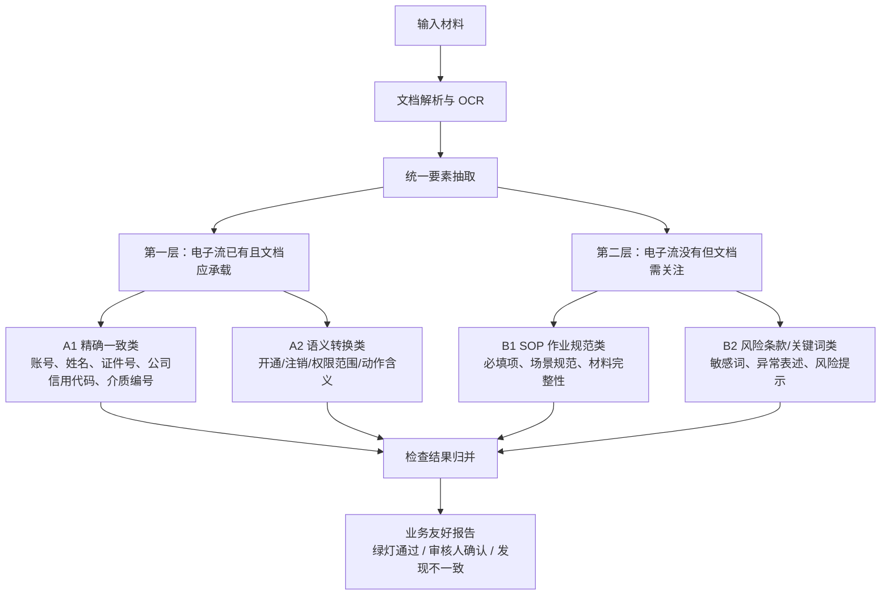

# 后端提取与检查分层方案

**文档定位**：用于指导后续后端提取、检查、规则配置和 prompt 拆分的当前方案文档。  
**更新时间**：2026-05-08  
**适用范围**：适用于 `contract_handle` 项目银行通道/网银权限材料 AI 预审 demo 的后续重构和产品化沟通。  
**核心结论**：后端检查逻辑应从“一个抽取 prompt + 一个语义检查 prompt”演进为“两层四块”的分层检查体系，分别处理电子流已有信息、电子流没有但文档需要关注的信息，并把 A2 语义转换类设计为“配置优先、规则/Prompt 兜底、工程版本扩展”的分层机制。

---

## 1. 第一性原理：后端到底在检查什么

本项目不是泛化的文档问答，也不是单纯的信息抽取系统。它要解决的问题是：

> 在对外提交银行材料前，以电子流为基准事实，帮助业务人员判断申请材料是否正确、完整、可复核地承载了本次办理事项，并额外提示材料中可能存在的业务经验风险。

因此后端检查对象天然分为两层：

1. 电子流中已有，且文档也应承载的信息。
2. 电子流中没有，但文档中仍需要业务关注的信息。

第一层回答“材料是否正确反映电子流”。  
第二层回答“材料自身是否存在业务经验上的风险或不规范表达”。

---

## 2. 两层四块总体框架



---

## 3. A1：精确一致类

### 3.1 业务含义

A1 处理电子流中已有、文档中也应出现，并且经过轻微标准化后仍必须保持一致的关键信息。

典型字段包括：

- 企业名称、统一社会信用代码。
- 申请人姓名、证件号。
- 名义用户、操作员、持有人。
- 账号、户名、账户状态。
- 平台代码、平台名称、银行名称。
- 介质编号、证书编号、Token/U盾编号。

### 3.2 实现原则

A1 不应依赖大模型主观判断。

合理分工是：

- AI/OCR：负责从文档中提取字段。
- 代码：负责清洗、标准化、匹配、比对和输出检查结果。
- 业务配置：负责字段别名、模板字段位置、清洗规则和少量容错规则。

### 3.3 当前代码承接情况

当前 `backend/services/hard_comparator.py` 已经承担 A1 的一部分：

- 公司证件号精确比对。
- OCR 证件实体是否在 EFlow 人员池中。
- 操作员账号绑定校验。

当前不足：

- 字段覆盖还不完整。
- 缺少统一字段标准化配置。
- 多用户、多账号、多介质之间的配对逻辑仍较弱。
- 检查结果没有显式标注所属检查层级。

---

## 4. A2：语义转换类

### 4.1 业务含义

A2 处理电子流中已有，但文档中不会以完全相同字段或固定枚举出现的信息。

典型例子：

- 电子流是“权限开通”，文档可能写“新增网银操作员”“开立企业网银权限”“申请付款复核权限”。
- 电子流是“权限注销”，文档可能写“取消操作员权限”“撤销网银服务”“停止使用该用户权限”。
- 电子流权限范围是 `authorize/payment/query/upload`，文档可能写“付款复核”“授权审批”“查询明细”“导入付款文件”。

这类信息不是简单字符串比对，而是“业务语义归一”。

### 4.2 不建议做成纯映射

A2 不应被理解为“纯映射表”。原因是：

- 同一句话在不同场景下含义可能不同。
- 同一个模板字段可能承载不同动作。
- 同一段文字可能同时表达业务场景、权限范围和介质动作。
- 新银行模板、新业务习惯、新表述会持续出现。

因此 A2 应设计为分层语义归一机制：

```text
原文表述
→ 已确认词典 / 别名 / 模板字段映射
→ 场景规则与上下文约束
→ LLM 语义判断
→ 低置信人工确认
→ 业务确认后沉淀回配置或版本
```

### 4.3 三层生效机制

| 类型 | 适用变化 | 生效方式 |
| --- | --- | --- |
| 业务配置类 | 同义词、字段别名、模板字段映射、枚举归一、提取优先级 | 业务确认后进入配置库，小样本回归后较快生效 |
| 规则 / Prompt 类 | 判断口径、风险等级、人工确认标准、语义规则补充 | 产品复核后进入规则或 prompt 版本，回归验证后生效 |
| 工程版本类 | 新数据结构、新算法、跨文档推理、原文定位、新业务场景 | 进入产品需求池，随工程版本开发、测试和发布 |

### 4.4 适合配置解决的 A2 事项

- “开立、开通、新增、启用、加挂”归一为 `OPEN`。
- “注销、取消、撤销、停用、停止使用”归一为 `CANCEL`。
- “U盾、USBKey、Token、数字证书”归一为介质类型。
- “付款复核、授权复核、审批付款”归入授权/支付相关权限组合。
- 某银行模板中的固定字段优先级，例如表格字段优先于正文说明。

### 4.5 更适合版本解决的 A2 事项

- 需要新增结构字段，例如经办、复核、授权层级关系。
- 需要复杂跨文档推理，例如 A 文档写开通，B 附件写注销，电子流又是变更。
- 需要新的对象配对算法，例如同一人多账号、多权限、多介质之间的关系绑定。
- 需要原文定位能力，例如 Word 表格单元格、PDF 坐标、高亮回看。
- 需要支持新业务场景，例如变更、限额调整、介质补发等。

### 4.6 当前代码承接情况

当前 A2 主要混在：

- `backend/prompts/prompts.json` 的 `global_document_extraction`。
- `backend/services/comparator.py` 的 `run_semantic_analyzer`。
- `semantic_risk_analyzer` prompt。

当前问题是 A2 与 B1/B2 混在同一个语义检查 prompt 中，导致模型既做字段归一，又做规范判断，还做风险提示，容易输出发散。

---

## 5. B1：SOP 作业规范类

### 5.1 业务含义

B1 处理电子流中没有，但业务基于作业经验、过去错题本、银行模板要求沉淀出来的固定检查点。

典型例子：

- 开通场景必须说明权限范围。
- 注销场景必须说明是否处理介质。
- 某类银行模板必须包含联系人电话。
- 某类申请必须明确平台或银行对象。
- 某些字段缺失不一定错误，但必须提示审核人确认。

### 5.2 实现原则

B1 应基于 SOP / 规则包 / 场景检查清单实现。

它不是和电子流比对，而是检查：

- 文档自身是否满足作业规范。
- 当前场景下是否有必要信息缺失。
- 是否存在应由审核人确认的事项。

### 5.3 推荐实现方式

```text
场景识别
→ 匹配 SOP 规则包
→ 读取文档结构化字段与全文片段
→ 执行规则/LLM 检查
→ 输出“审核人确认”或“建议补充/修正”
```

---

## 6. B2：风险条款 / 关键词类

### 6.1 业务含义

B2 处理材料中出现即需要业务关注的风险表达。

典型例子：

- “全权限”
- “所有账户”
- “不限额”
- “长期有效”
- “代操作”
- “空白介质”
- “无需注销”
- “保留原权限”
- “任意账户”

### 6.2 实现原则

B2 更像全文风险扫描。

优先级建议：

1. 结构化字段中能命中的，先用结构化字段命中。
2. 结构化字段不足时，扫描全文。
3. 命中高风险关键词后，必要时让 AI 阅读上下文判断是否真的需要提示。
4. 输出默认是“风险提示”或“审核人确认”，不直接等同于错误。

---

## 7. 后端目标流程

当前后端流程是：

```text
文档解析
→ LLM 抽取
→ 硬规则比对
→ 语义检查
→ 全局汇总
```

建议演进为：

```text
文档解析
→ 统一要素抽取
→ A1 精确一致检查
→ A2 场景/权限/动作语义归一检查
→ B1 SOP 作业规范检查
→ B2 风险条款/关键词扫描
→ 检查结果分层归并
→ 业务报告
```

---

## 8. 建议的代码拆分方向

### 8.1 新增检查器分层

建议后续在 `backend/services` 下逐步拆出：

| 建议模块 | 职责 |
| --- | --- |
| `exact_consistency_checker.py` | A1 精确一致类检查 |
| `semantic_normalizer.py` | A2 场景、动作、权限、介质语义归一 |
| `sop_checker.py` | B1 SOP 作业规范检查 |
| `risk_clause_checker.py` | B2 风险条款和关键词扫描 |
| `check_registry.py` | 汇总检查器、统一执行顺序和结果归并 |

### 8.2 Prompt 拆分方向

当前不建议继续扩大 `semantic_risk_analyzer`。

更稳妥的方式是拆成：

| Prompt | 目标 |
| --- | --- |
| `document_fact_extraction` | 只抽取文档事实，不做风险判断 |
| `semantic_normalization` | 只做场景、动作、权限、介质的语义归一 |
| `sop_review` | 按场景 SOP 检查材料完整性和规范性 |
| `risk_clause_review` | 阅读全文，识别风险条款和敏感表达 |
| `global_business_summary` | 汇总业务结论，不重复制造新检查项 |

### 8.3 CheckResult 增强方向

建议给检查结果增加或约定以下字段语义：

| 字段 | 建议含义 |
| --- | --- |
| `check_layer` | `EFLOW_BASED` / `DOCUMENT_ONLY` |
| `check_block` | `A1_EXACT` / `A2_SEMANTIC` / `B1_SOP` / `B2_RISK_CLAUSE` |
| `confidence` | 模型或规则判断置信度 |
| `requires_config_review` | 是否适合沉淀为业务配置 |
| `requires_engineering_change` | 是否疑似需要工程版本解决 |

如果短期不改 Pydantic 结构，可以先把这些信息编码进 `check_mode`、`reason_code` 或 `category`，但长期建议显式结构化。

---

## 9. 近期实施建议

### 9.1 Demo 阶段

优先做低风险拆分，不急着重构所有结构：

1. 在文档和 prompt 中明确两层四块。
2. 将 `semantic_risk_analyzer` 的职责收窄，避免同时做 A2/B1/B2。
3. 先新增 B2 风险关键词扫描的轻量代码检查器。
4. A2 先维护一个小型配置映射表，验证“配置优先”的可行性。
5. 报告页继续保持三类结果：绿灯通过、审核人确认、发现不一致。

### 9.2 产品化阶段

需要补齐：

1. 语义归一配置库。
2. SOP 规则库。
3. 风险关键词/条款库。
4. 业务确认与版本化流程。
5. 回归样本集与批量跑数。
6. 配置变更与工程版本变更的分流机制。

---

## 10. 对产品和业务的沟通话术

后端检查逻辑不是简单地“让 AI 多看一点”，而是把检查对象分清楚：

- 电子流里已有的关键信息，能精确比对的必须精确比对。
- 电子流里已有但文档表达复杂的信息，先沉淀业务确认过的语义映射，再让 AI 处理例外和低置信场景。
- 电子流里没有但业务经验要求关注的信息，做成 SOP 和风险条款检查。
- AI 负责辅助理解和归因，但最终有效规则必须经过业务确认、回归验证和版本化管理。

这样业务能知道自己要补哪些规则，产品能知道哪些做配置、哪些进版本，技术能知道哪些交给代码、哪些交给模型。
