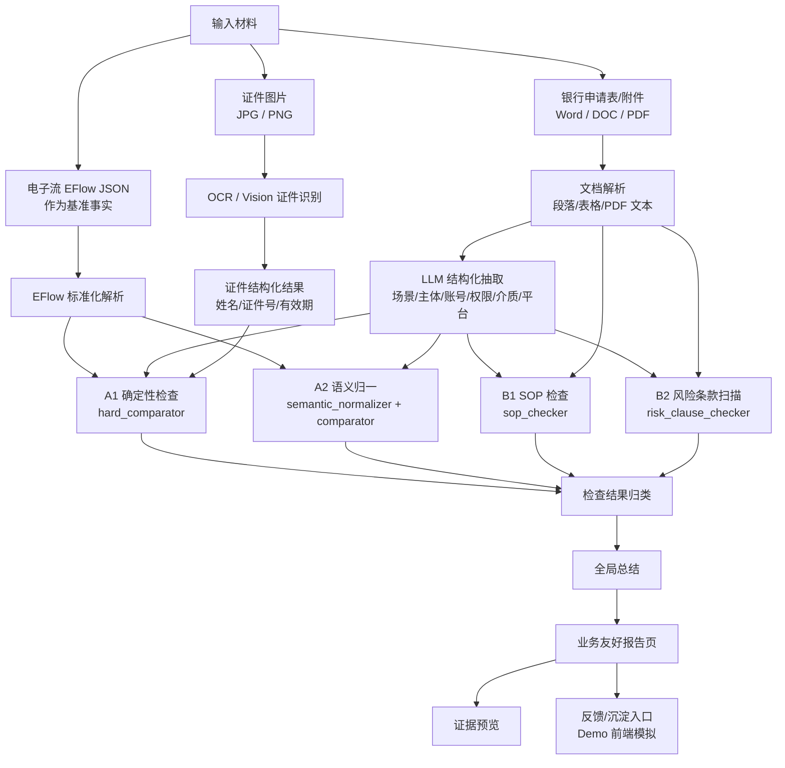
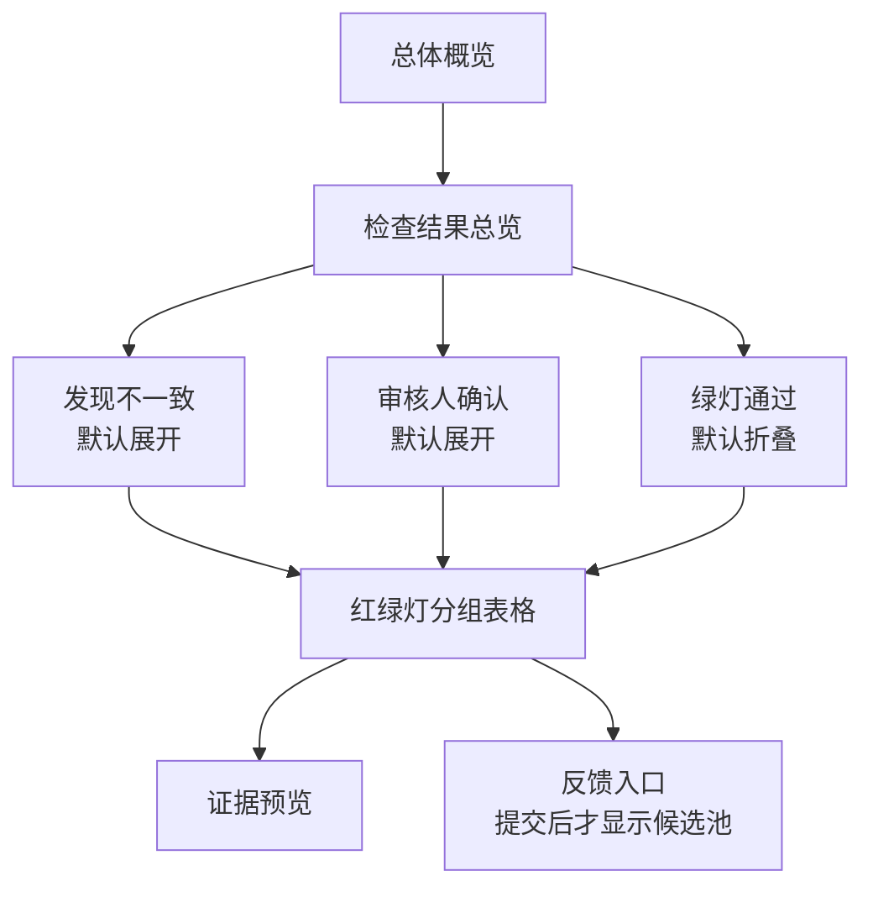
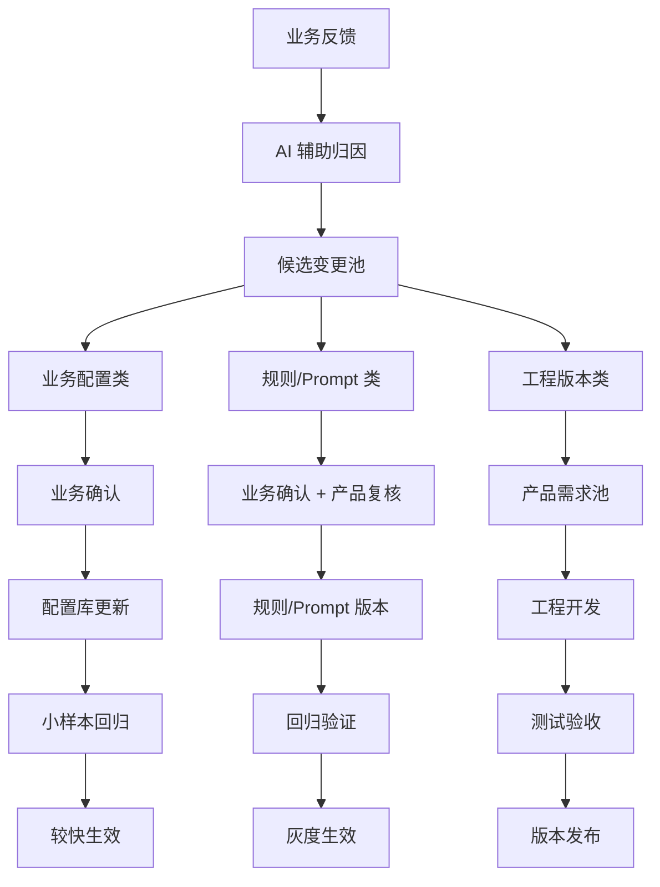
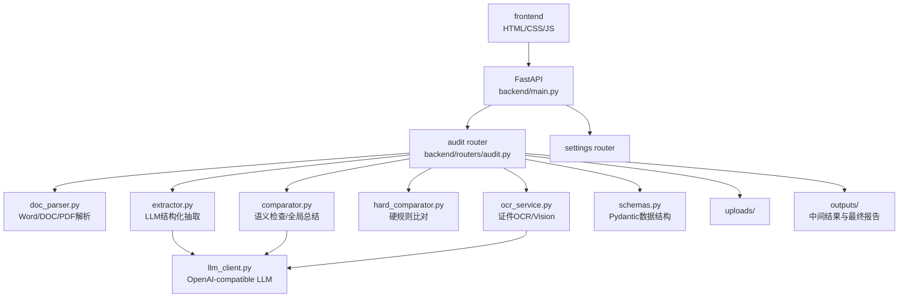

# 银行网银权限材料 AI 预审项目：当前方案与产品交接文档

**文档定位**：面向产品、业务和后续实施团队的当前版本交接文档。

**更新时间**：2026-05-12

**适用范围**：仅适用于 `contract_handle` 项目当前 demo、后续产品沟通和实施拆解。

**与历史文档关系**：本文刷新并统领此前业务背景、架构、提示词、前端报告和运营闭环讨论。早期文档可作为过程材料参考，但当前对外沟通和产品交接建议优先以本文为准。

---

## 1. 项目一句话定位

本项目是面向支付部门会计作业人员的 **银行通道/网银权限申请材料 AI 预审助手**。

它不是审批系统，也不是流程控制点，而是在正式对外提交银行材料前，以电子流为基准事实，帮助申请人、审核人和审批人提前发现材料中的场景、主体、账号、权限、介质、平台、证件等要素问题，降低对外报送错误和资金收付安全风险。

---

## 2. 业务背景与真实问题

### 2.1 服务对象

| 角色 | 典型用户 | 主要诉求 |
| --- | --- | --- |
| 申请人 | 一线会计作业人员、低级作业人员 | 准备银行申请表、附件、证件等材料，减少漏填、错填、错对象 |
| 审核人 | 会计/支付业务审核人员 | 快速知道哪些材料一致，哪些需要重点复核，依据在哪里 |
| 审批人 | 领导或更高层级把关人员 | 关注关键风险和对外提交前的材料质量，不希望陷入字段细节 |
| 产品/运营人员 | 后续实施方和规则运营方 | 需要把业务反馈沉淀为模板、字段映射、规则和版本迭代 |

### 2.2 业务风险

银行通道/网银权限材料属于对外提交材料。若出现错误，不只是内部返工问题，还可能造成：

- 向银行传递错误企业、账号、人员、权限或介质信息。
- 开通或注销对象错误。
- 权限范围超配、少销、误销或保留不当。
- 证件、平台、账号信息不一致。
- 进一步影响资金收付安全和作业合规秩序。

### 2.3 设计边界

当前方案必须明确：

- AI 做预审、整理、提示、聚焦，不替代人工审批。
- AI 不输出“阻断、放行、不可提交、自动审批”等控制性结论。
- AI 结论必须服务于业务可读、可复核、可追溯。
- 不确定事项必须显性标记为“审核人确认”，不能伪装成确定结论。

---

## 3. 当前业务目标

从第一性原理看，本项目要解决的不是“能不能抽字段”，而是：

> 在对外提交银行材料之前，让业务人员以最小理解成本知道：这次要办什么、材料写了什么、哪些已经一致、哪些不一致、哪些 AI 当前无法判断需要审核人看、依据在哪里。

当前阶段目标按优先级排序：

1. 对外信息准确。
2. 作业质量和作业秩序稳定。
3. 风险提前暴露。
4. 业务用户看得懂、知道下一步怎么处理。
5. 后续可通过反馈持续沉淀规则。

---

## 4. 当前 demo 已实现的核心链路



### 当前主链路说明

1. 上传或选择测试用例。
2. 读取 `EFlow JSON`，构建本次办理的基准事实。
3. 逐份解析 Word/DOC/PDF 申请材料。
4. 调用 LLM 将文档内容抽取为统一业务结构。
5. 对证件图片进行 OCR/Vision 识别。
6. 执行硬规则比对和语义检查。
7. 执行 SOP 检查和高风险条款扫描。
8. 生成全局总结和检查结果。
9. 前端按业务语言展示概览、互斥统计分组、证据预览。

### 当前两层四块检查落地

| 检查块 | 当前模块 | 主要解决的问题 | 前端表达 |
| --- | --- | --- | --- |
| A1 核心信息一致性 | `backend/services/hard_comparator.py` | 公司证件号、平台、账号、户名、账户状态、介质编号、证件有效期、多操作员对象匹配等确定性比对 | 关键信息一致性 |
| A2 业务语义理解 | `backend/services/semantic_normalizer.py` + `backend/services/comparator.py` | 开通/注销/变更、权限范围、办理动作、介质类型等语义归一和兜底检查 | 业务语义理解 |
| B1 材料合规合理性 | `backend/services/sop_checker.py` + `backend/rules/sop_rules.json` | 必填占位、电话/工号格式、办理事项反向表述、权限组合、限额币种等 | 材料合规合理性 |
| B2 风险条款提示 | `backend/services/risk_clause_checker.py` + `backend/rules/risk_clauses.json` | 无限责任、不可撤销、自动续期、银行单方变更权限、长期有效等风险表述 | 风险条款提示 |

---

## 5. 当前功能能力地图

| 能力 | 当前状态 | 说明 |
| --- | --- | --- |
| EFlow 基准事实解析 | 已实现 | `backend/routers/audit.py` 读取并转换为 `EFlowData` |
| 多文档输入 | 已实现 | 支持多份 Word/DOC/PDF 和多张证件图片 |
| Word/DOC/PDF 文档解析 | 已实现基础版 | `doc_parser.py` 解析段落、表格、PDF 文本 |
| 文档结构化抽取 | 已实现 | `extractor.py` 调用 `global_document_extraction` prompt |
| 证件识别 | 已实现基础版 | `ocr_service.py`，含 PaddleOCR / Vision fallback |
| 硬规则比对 | 已实现部分 | 公司、账号、人员、证件有效期等确定性检查 |
| 语义归一与语义检查 | 已实现 | 配置化语义映射 + `semantic_risk_analyzer` 单文档语义审查 |
| SOP 作业规范检查 | 已实现轻量版 | `sop_checker.py`，检查占位符、格式、场景冲突、权限组合等 |
| 风险条款扫描 | 已实现轻量版 | `risk_clause_checker.py`，命中高风险关键词并提供上下文片段 |
| 全局总结 | 已实现 prompt 版 | `multi_doc_summary` 输出整体概述和人工确认项 |
| 业务友好报告页 | 已实现当前版 | 互斥统计、分组明细、证据预览、技术信息折叠 |
| 反馈/沉淀入口 | Demo 模拟 | 前端内存记录，不落库、不真实生效 |
| 跨文档交叉校验 | 尚未真正实现 | `cross_validation_checks` 当前为空 |
| 原文精确定位 | 尚未实现 | 当前仅为片段级证据，不支持页码/坐标/高亮 |
| 规则配置生效 | 尚未实现 | 目前没有配置库、审批流、版本发布和回归验证 |

### 多用户/多活动场景当前支持程度

当前数据结构支持一个 EFlow 或一份文档下包含多个 `users`。每个 `UserPermission` 表示一个用户/账号/权限/介质对象，包含用户姓名、账号、权限范围、介质、限额和权限动作。

本轮已补强 A1 对象匹配能力：

- 支持按姓名、账号、介质编号、角色进行轻量匹配。
- 支持识别“EFlow 中有，但材料中未稳定识别”的用户对象。
- 支持识别“材料中出现，但 EFlow 中没有稳定匹配”的用户对象。
- 支持一名用户账号字段中出现多个账号时，按账号集合交集比对。
- 支持逐用户比较授权、支付、查询、上传四类权限。

当前仍是 demo 级能力：一人多账号、一人多活动、多权限动作链路还没有拆成更细的 `accounts[] / activities[] / permission_items[]` 结构，产品化阶段建议继续拆细。

测试覆盖方面，`test_data/case_015_boc_multi_pass` 已调整为真实多用户 EFlow，用于验证两名操作员的抽取、对象配对和逐用户权限核对。

---

## 6. 当前前端报告设计

领导反馈后，当前报告页已从“审计工作台”收敛为更适合会计/财务用户的业务阅读方式。

### 6.1 页面结构



### 6.2 统计口径

当前统计采用互斥口径，避免用户看到数字对不上：

```text
共检查 = 绿灯通过 + 审核人确认 + 发现不一致
```

| 分类 | 含义 | 用户应如何理解 |
| --- | --- | --- |
| 绿灯通过 | 材料与电子流或检查逻辑一致 | 通常无需优先处理 |
| 审核人确认 | 当前检查逻辑无法直接判断，或 AI 置信度不足 | 需要审核人结合业务背景查看 |
| 发现不一致 | 系统发现材料与电子流/规则之间存在明确差异 | 建议补充、修正或重点复核 |

### 6.3 阅读体验设计

- 不再默认展示“重点预览”。
- 不再默认展示规则码、字段簇、check_mode 等技术信息。
- 红灯和黄灯默认展开，绿灯默认折叠，避免业务用户被大量通过项淹没。
- 检查结果以表格展示，列出状态、检查内容、检查范围、建议动作和依据。
- 证据弹层默认只展示业务可读信息：
  - 电子流中登记的信息。
  - 申请材料中识别的信息。
  - 来源文档。
  - 涉及内容。
  - 材料原文/解析片段。
- 技术信息仅放在折叠项“给产品/IT查看的技术信息”中。

---

## 7. 当前数据结构与检查结果

核心结构来自 `backend/models/schemas.py`。

### 7.1 输入和抽取结构

| 结构 | 用途 |
| --- | --- |
| `EFlowData` | 电子流基准事实，包含平台、公司、申请人、用户权限、账号、介质 |
| `DocExtractedData` | 单份文档或证件抽取结果，包含场景、动作、公司、人员、账号、权限、介质 |
| `UserPermission` | 单用户/单账号维度的权限和介质信息 |
| `PermissionScope` | 授权、支付、查询、上传四类权限归一 |
| `MediaInfo` | U盾/Token/证书等介质信息 |

### 7.2 检查结果结构

`CheckResult` 是当前报告的核心检查项结构：

| 字段 | 当前用途 |
| --- | --- |
| `check_name` | 检查项名称，前端会转换为业务标题 |
| `category` | 检查分类 |
| `field_group` | 字段簇，如 `permission/account/subject` |
| `source_a_value` | 电子流侧值 |
| `source_b_value` | 文档侧值 |
| `severity` | 内部风险等级：`CRITICAL/WARNING/INFO/PASS` |
| `manual_confirmation_required` | 是否需要审核人确认 |
| `reason_code` | 内部规则码 |
| `detail` | 检查说明，前端会尽量业务化翻译 |
| `check_layer` | 两层检查框架：`EFLOW_BASED` / `DOCUMENT_ONLY` |
| `check_block` | 四块检查框架：`A1_EXACT` / `A2_SEMANTIC` / `B1_SOP` / `B2_RISK_CLAUSE` |
| `traffic_light` | 红绿灯状态：`GREEN` / `YELLOW` / `RED` |
| `business_status` | 业务状态：`PASS` / `REVIEW` / `NEED_FIX` |
| `confidence` | 检查置信度 |
| `requires_config_review` | 是否适合沉淀为业务配置或规则候选 |

### 7.3 前端业务化转换

前端 `frontend/app.js` 已增加展示层翻译逻辑：

- `businessFieldLabel`
- `businessCheckTitle`
- `businessDetailText`
- `formatBusinessValue`

这些函数负责将 `permission_scope`、`authorize/payment/query/upload`、`OPEN/CANCEL`、`field_group`、`reason_code` 等工程信息翻译为业务可读表达。

---

## 8. Prompt 与规则体系现状

当前 prompt 位于 `backend/prompts/prompts.json`。

| Prompt | 用途 |
| --- | --- |
| `global_document_extraction` | 面向 Word/PDF 的通用结构化抽取 |
| `semantic_risk_analyzer` | 单文档与 EFlow 基准的语义检查 |
| `multi_doc_summary` | 全局总结和人工确认项汇总 |
| `id_extraction_fallback` | OCR 失败或不足时的证件信息补充抽取 |

当前规则配置位于：

| 文件 | 用途 |
| --- | --- |
| `backend/rules/semantic_mappings.json` | A2 场景、动作、权限、介质的语义映射 |
| `backend/rules/sop_rules.json` | B1 SOP 检查的占位符、反向场景词、币种词、邮箱后缀等配置 |
| `backend/rules/risk_clauses.json` | B2 高风险条款/关键词词库 |

关键 Prompt 的完整职责和核心内容已整理在 `后端提取与检查分层方案.md` 第 5 节，后续如要调整 Prompt，应同步更新该文档。

当前 prompt 已加入角色边界：

- 本系统是辅助预审工具。
- 不做流程控制点。
- 不做拦截、阻断或自动审批结论。
- 输出应使用“建议复核、重点关注、建议补充/修正、需人工确认”等辅助性表述。

---

## 9. 反馈与规则迭代闭环设计

### 9.1 当前 demo 状态

当前 demo 中保留了“反馈”按钮，但它只是前端内存模拟：

- 用户可对某条事项提交反馈。
- 系统根据反馈类型生成候选项。
- 候选项只在页面中展示，不落库。
- 刷新后丢失。
- 不会真正更新字段映射、规则、prompt 或代码。

默认页面不会展示“规则迭代闭环”说明，避免业务用户看到产品/IT语言。只有用户提交反馈后，候选池才出现。

### 9.2 产品化建议

后续反馈应进入受控闭环，而不是直接让 AI 修改系统。



| 类型 | 示例 | 生效方式 |
| --- | --- | --- |
| 业务配置类 | 字段别名、模板映射、枚举归一、提取优先级 | 业务确认后进入配置库，小样本回归后较快生效 |
| 规则/Prompt 类 | 风险等级调整、人工确认口径、语义规则补充 | 产品复核、版本化、回归验证后灰度生效 |
| 工程版本类 | PDF/Word 原文定位、复杂跨文档校验、解析器增强 | 进入产品版本需求池，随工程版本发布 |

### 9.3 后续需要补的系统能力

1. 反馈落库。
2. 候选变更状态流转。
3. 配置库/规则库/Prompt 版本管理。
4. 回归样本集。
5. 生效前后效果对比。
6. 审计日志与权限控制。

---

## 10. 当前技术架构



### 10.1 后端入口

- `backend/main.py`
  - FastAPI 应用。
  - 挂载前端静态文件。
  - 注册 `/api/health`。
  - 注册全局异常处理。

- `backend/routers/audit.py`
  - `/api/audit/run`
  - `/api/audit/run-from-testcase`
  - `/api/audit/testcases`
  - 当前主编排逻辑集中在 `_run_pipeline`。

### 10.2 前端入口

- `frontend/index.html`
- `frontend/app.js`
- `frontend/style.css`

当前核心前端函数：

| 函数 | 用途 |
| --- | --- |
| `renderV15Report` | 总体报告渲染入口 |
| `renderRiskInsights` | 总体概览和 LLM 总结 |
| `renderCheckOverviewBoard` | 业务友好检查结果总览 |
| `collectCheckStats` | 互斥统计口径 |
| `showEvidence` | 证据预览弹层 |
| `submitFeedbackCandidate` | Demo 反馈候选提交 |
| `renderRuleCandidatePanel` | 反馈后候选池展示 |
| `renderClusteredChecks` | 全部检查明细，默认收起 |

---

## 11. 当前实现的主要限制

### 11.1 业务与产品限制

- 当前规则覆盖仍依赖有限样本和 prompt。
- 不同银行模板、不同业务场景的字段差异还未系统化沉淀。
- 风险标签和人工确认口径仍需业务进一步确认。
- 当前 demo 更适合展示方向，不等同于上线可用产品。

### 11.2 技术限制

- 跨文档交叉校验尚未真正实现。
- 原文定位只是片段级证据，不支持页码、坐标、表格单元格高亮。
- 反馈不落库，不会真实影响下一次检查。
- 配置变更、规则变更和工程版本变更尚未拆成后台能力。
- Prompt 输出稳定性仍需要真实样本批量回归验证。
- 当前前端业务化翻译是展示层逻辑，不等同于后端结构已完全业务化。

---

## 12. 下一阶段产品沟通建议

### 12.1 业务侧要确认的问题

1. 真实办理场景范围：开通、注销、变更、加挂、介质处理等。
2. 各场景必填字段、可选字段和强关注字段。
3. 不同角色最关心的结论表达方式。
4. 哪些错误属于必须重点复核。
5. 哪些不确定事项应归入“审核人确认”。
6. 需要准备一批真实脱敏样本用于批量回归。

### 12.2 产品侧要确认的问题

1. 页面是否以“检查结果总览”为主视图。
2. 是否需要角色化视图：申请人/审核人/审批人。
3. 反馈入口是否上线一期就做，还是先做运营台账。
4. 业务配置类、规则/Prompt 类、工程版本类的发布边界。
5. 模板库、字段映射库、规则库的管理方式。
6. 验收指标：抽取准确率、误报率、漏报率、人工确认项可解释性等。

### 12.3 技术侧要确认的问题

1. 是否建设证据定位能力。
2. 是否引入 PDF/Word 预览和高亮。
3. 是否建设跨文档关系校验。
4. 是否建设配置中心。
5. 是否建设回归测试集和批量跑数工具。
6. 是否需要接入真实电子流系统。

---

## 13. 建议的产品化路线

### 阶段一：Demo 对齐与业务样本验证

- 固定当前业务友好报告页。
- 准备脱敏真实样本。
- 批量跑数，记录误报、漏报、人工确认项。
- 输出字段映射表、问题规则候选表、模板差异表。

### 阶段二：规则与模板资产化

- 建设字段映射配置。
- 建设模板库。
- 建设业务规则库。
- 将可配置事项与工程事项分流。
- 建立业务确认和回归验证流程。

### 阶段三：证据链与产品化工作台

- 支持 Word/PDF 原文定位。
- 支持证据高亮。
- 支持审核人反馈落库。
- 支持规则候选池和版本化发布。
- 支持线上运营指标看板。

### 阶段四：系统集成与上线运营

- 接入真实电子流。
- 接入身份与权限体系。
- 接入日志、审计和密级要求。
- 建立上线门槛和持续运营机制。

---

## 14. 当前代码状态摘要

截至本文：

- 已推送的最近材料提交：`44c6089 Add product handoff deck materials`
- 当前文档目录已收敛为中文可读结构：
  - `docs/当前方案与产品交接文档.md`
  - `docs/后端提取与检查分层方案.md`
  - `docs/报告页展示逻辑.md`
  - `docs/产品交接汇报材料/`
  - `docs/归档/历史方案与过程文档/`
- 当前后端正在按“两层四块”方向补充分层元信息和 A2 语义归一配置，详见 `后端提取与检查分层方案.md`。

---

## 15. 对产品同事的核心交接话术

这个项目不是一个“AI 自动填表”系统，而是一个“对外银行材料提交前的 AI 预审助手”。

当前 demo 已证明主链路可跑通：电子流基准、多文档解析、结构化抽取、规则/语义检查、业务友好报告展示。下一阶段的核心不是继续堆更多检查项，而是围绕真实样本，把字段映射、模板差异、规则口径、人工确认标准和证据链能力沉淀成可运营、可验证、可版本化的产品能力。
