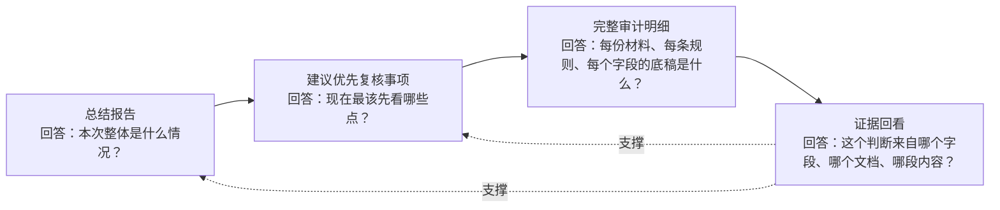

# 网银权限材料 AI 预审报告页：核心思路与展示逻辑

**适用场景**：面向支付部门会计作业人员，在准备对外提交银行通道/网银权限申请材料前，由 AI 辅助完成材料预审、问题聚焦与依据回看。

## 1. 一句话定位

本方案不是让 AI 替代审批，也不是把 AI 变成流程控制点，而是把 AI 定位为“对外提交前的材料预审助手”：以电子流为基准事实，对申请材料中的主体、账号、权限、介质、平台、证件与业务场景进行解析、比对和风险分层，帮助申请人、审核人、审批人更快知道“本次要办什么、材料说了什么、哪里需要重点复核、依据在哪里”。

## 2. 设计原则

| 原则 | 含义 | 对页面的影响 |
| --- | --- | --- |
| 电子流是基准事实 | 先明确本次系统里应该办理什么业务，再看材料是否一致 | 总结区先展示“电子流应办理”，再展示“材料实际说明” |
| AI 是辅助预审，不是控制点 | AI 给出建议、提示和依据，不替代业务判断 | 页面避免使用“阻断、放行、不可提交”等控制性表述 |
| 先结论，再聚焦，再底稿 | 领导和审核人先看全局，再看优先事项，最后回到完整明细 | 报告页收敛为三段式结构 |
| 不确定性要显性化 | AI 无法稳定判断时，不假装确定，而是标记“需人工确认” | “需人工确认”作为横向标签，可叠加在风险项上 |
| 每个结论都要能回看依据 | 对外材料错误风险高，必须能看到结论来源 | 每条重点事项提供“查看依据”悬浮卡片 |

## 3. 报告页三段式结构

### 1. 总结报告：给出全局判断

总结报告服务于“快速建立整体认知”，不承载所有明细。它重点说明：

- 电子流基准：本次应该办理开通、注销、变更还是其他权限活动，涉及哪些主体、账号、权限、介质和平台。
- 材料事实：上传材料整体说明的业务场景和关键对象是什么。
- 总体结论：本次材料是否存在重点风险、风险提示或需人工确认事项。
- 关键洞察：最多展示 3 条最重要的风险洞察，避免让用户在顶部被长列表淹没。

### 2. 建议优先复核事项：给出处理顺序

这一段不是新的检查结论，也不是只显示“前八个问题”。它是对全量检查结果做辅助排序后的“复核队列”。

排序依据包括：

- 风险影响程度：重点风险优先于一般提示。
- 是否需要人工确认：AI 不确定但业务上重要的事项要被显性提醒。
- 是否涉及核心字段：业务场景、主体、账号、权限、介质、平台、证件有效期等字段优先。

默认展示 8 条，是为了在 demo 和真实作业中降低首屏认知负担；其余事项并未丢弃，可以展开查看。这里的排序只帮助用户聚焦，不改变原有业务办理链路。

### 3. 完整审计明细：保留全量底稿

完整审计明细服务于“可复核、可解释、可追溯”。它按文件展示：

- 文件抽取事实：AI 从该文件中识别到的场景、主体、账号、权限、介质等关键要素。
- 检查结果：硬规则、语义检查和跨文档检查的全部非通过项与通过项。
- 字段差异：电子流字段与文档字段之间的对比结果。
- 查看依据：对重点事项或具体检查项，可打开悬浮证据卡片回看来源。

## 4. 风险标签关系

| 标签 | 含义 | 是否风险等级 |
| --- | --- | --- |
| 重点风险 | 可能影响对外材料准确性、权限范围、账号对象或资金收付安全，需要优先复核 | 是 |
| 风险提示 | 存在不一致、遗漏或场景歧义，需要审核人关注 | 是 |
| 优化建议 | 不一定影响办理，但建议补充或规范表达 | 是 |
| 需人工确认 | AI 无法稳定判断，或该事项需要业务人员结合上下文确认 | 不是风险等级，是横向标记 |

因此，“需人工确认”可以和“重点风险”同时出现：它表示这条事项既重要，又不能完全依赖 AI 自动判断。

## 5. 对领导沟通时的核心表达

这套页面不是把信息展示得更多，而是把材料预审从“字段堆叠”收敛成“业务可执行的复核路径”：

1. 先看总结报告，知道本次整体业务和主要风险。
2. 再看建议优先复核事项，知道最值得先核实的事项和原因。
3. 最后进入完整审计明细，回看每份材料的抽取事实、规则命中和证据依据。

最终目标是让 AI 帮业务人员在对外提交前更早发现问题、更快聚焦重点、更清楚说明依据，而不是替代人做审批判断。
