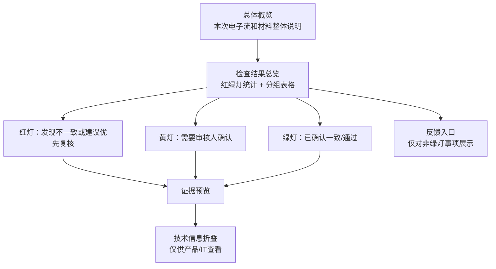

# 网银权限材料 AI 预审报告页：当前展示逻辑

**文档定位**：记录当前前端报告页的真实实现逻辑，说明后端检查结果如何转化为业务用户可读的红绿灯报告。

**更新时间**：2026-05-12

**适用场景**：支付部门会计作业人员在对外提交银行通道/网银权限申请材料前，使用 AI 辅助完成预审、问题聚焦与依据回看。

---

## 1. 页面一句话定位

报告页不是审计系统，也不是流程控制台，而是一个“材料预审阅读页”：

> 先告诉业务用户本次整体是什么，再用红绿灯说明检查了多少内容、哪些已一致、哪些发现不一致、哪些需要审核人确认，最后让用户能点开依据回看。

页面避免使用“阻断、放行、不可提交”等控制性语言。

---

## 2. 当前页面结构

当前页面从早期“重点问题工作台 + 全量审计明细”的复杂结构，收敛为更简约的三段：



### 2.1 总体概览

由 `multi_doc_summary` Prompt 生成，主要展示：

- 本次电子流应该办理什么业务。
- 本次材料整体说明了什么业务。
- 文件数量、平台、用户、权限、账号、介质等核心摘要。
- 少量关键风险洞察。

### 2.2 检查结果总览

由 `frontend/app.js` 的 `renderCheckOverviewBoard()` 渲染。

上方 4 个数字：

| 指标 | 含义 |
| --- | --- |
| 共检查 | 本次所有检查项数量 |
| 绿灯通过 | 已按现有规则确认一致，或未发现明显异常 |
| 发现不一致 | 与电子流、材料规范或风险词库存在明确冲突或差异 |
| 审核人确认 | 当前逻辑无法直接判断，需要结合业务背景查看 |

统计采用互斥口径：

```text
共检查 = 绿灯通过 + 发现不一致 + 审核人确认
```

### 2.3 分组表格

当前不再展示“前 8 条重点预览”。所有检查项按红绿灯分为三组：

1. 发现不一致或建议优先复核。
2. 需要审核人确认。
3. 已确认一致/通过。

红灯和黄灯默认展开，绿灯默认折叠。

表格列：

| 列 | 说明 |
| --- | --- |
| 状态 | 红绿灯状态 |
| 检查内容 | 业务标题 + 业务说明 |
| 检查范围 | A1/A2/B1/B2 翻译后的业务范围 + 来源文件 |
| 建议动作 | 建议补充/修正、建议确认、已通过等 |
| 依据 | 查看依据、反馈 |

---

## 3. 前端如何理解后端字段

前端优先使用后端新增字段：

| 后端字段 | 前端用途 |
| --- | --- |
| `traffic_light` | 决定红绿灯分组 |
| `business_status` | 业务状态备用字段 |
| `check_block` | 展示检查范围 |
| `check_layer` | 区分电子流比对类和文档自身检查类 |
| `source_a_value` | 证据弹层里的电子流/规则侧信息 |
| `source_b_value` | 证据弹层里的材料侧信息 |
| `evidence` | 原文或命中片段 |
| `reason_code` | 折叠技术信息，不默认给业务用户看 |

### 3.1 红绿灯映射

前端函数：`trafficLight(check)`

优先读取 `check.traffic_light`，如果后端旧数据没有这个字段，则兼容旧逻辑：

```text
severity == PASS                  -> GREEN
manual_confirmation_required=true -> YELLOW
其他非 PASS                       -> RED
```

### 3.2 检查范围映射

前端函数：`checkBlockLabel(check)`

| `check_block` | 页面表达 |
| --- | --- |
| `A1_EXACT` | 关键信息一致性 |
| `A2_SEMANTIC` | 业务语义理解 |
| `B1_SOP` | 材料合规合理性 |
| `B2_RISK_CLAUSE` | 风险条款提示 |

---

## 4. 证据预览

点击“看依据”会打开右侧证据抽屉。

默认展示业务用户需要的信息：

1. 检查标题。
2. 红绿灯结果。
3. 检查说明。
4. 电子流/规则侧信息。
5. 材料识别信息。
6. 来源文档。
7. 涉及内容。
8. 材料原文或解析片段。

技术字段默认折叠：

- 字段簇。
- 字段名。
- 检查方式。
- 规则码。

当前证据能力仍是片段级，尚不支持 Word 单元格、PDF 坐标、页面高亮等精确定位。

---

## 5. 反馈入口

当前反馈入口是 demo 模拟能力：

- 只有非绿灯事项展示反馈按钮。
- 用户提交反馈后，页面生成候选项。
- 候选项只保存在前端内存中，不落库。
- 刷新后丢失。
- 不会真实修改配置、Prompt 或代码。

页面默认不展示“规则迭代闭环”这类产品/IT语言，避免干扰业务用户。只有用户提交反馈后，候选池才出现。

---

## 6. 当前页面设计原则

| 原则 | 当前实现 |
| --- | --- |
| 信息少而清楚 | 上方只保留 4 个数字，下方用表格而不是大量卡片 |
| 红绿灯表达 | 用红/黄/绿直接表达处理优先级 |
| 技术信息后置 | 规则码、字段名、check_mode 放进折叠项 |
| 不制造控制感 | 不说阻断、不可提交、放行 |
| 依据可回看 | 每条检查项可点开证据抽屉 |
| 数字口径一致 | 使用互斥统计，避免总数和明细对不上 |

---

## 7. 当前限制

1. 证据预览还不是原文精确定位。
2. 绿灯项默认折叠，但仍可能数量较多，后续可增加筛选。
3. 重复或相近检查项仍可能来自配置化 A2 与 LLM A2 的重叠输出。
4. 反馈候选池只是前端模拟，没有真实运营闭环。
5. 页面样式已向企业后台表格化收敛，但还未形成正式设计系统组件。

---

## 8. 后续建议

1. 在后端进一步去重同类检查项，减少页面负担。
2. 建立证据定位结构：文档名、页码、段落、表格行列、PDF 坐标。
3. 增加状态筛选和字段范围筛选，但默认仍保持简洁。
4. 反馈闭环落库后，区分业务配置类、规则/Prompt 类、工程版本类。
5. 把页面文案继续面向财务/会计用户做语言打磨，减少 AI 和 IT 术语。
